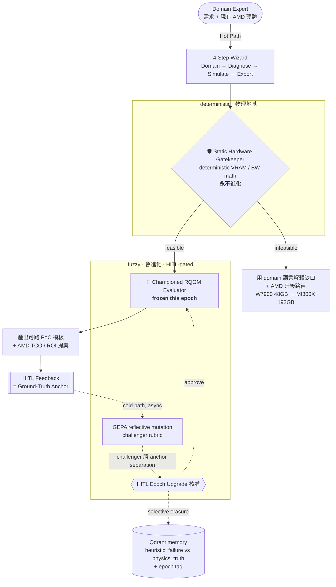

# AgentForge

**自我進化的 AI Agent 選型與教育平台 · 100% open-source · AMD ROCm stack**

> 輸入你的 AI 需求 ＋ 你**現有的 AMD 硬體** → 平台給你「用手上這台機器就能跑的、**可驗證**的最快 PoC」，
> 並用**你的產業語言**解釋「還差哪一塊硬體、升級後能解鎖什麼下一階能力」。
>
> Input your AI need + your **current AMD hardware** → get the fastest **verifiable** PoC on what you already
> own, plus a domain-language explanation of exactly which upgrade unlocks the next level of capability.

> [!IMPORTANT]
> **SIMULATED disclaimer** — 本專案的開發機為 **Ryzen AI + Radeon**。
> Tier 1–3（Ryzen AI / Radeon / Radeon PRO）為**真跑 (real hardware)**；
> Tier 4 **Instinct (MI300X / MI325X)** 的所有數字皆由 deterministic 物理公式**模擬 (SIMULATED)**，
> UI 與匯出文件都會明確標註 `SIMULATED` / `SIM` 徽章。

---

## 為什麼 (Why) — 三堵牆

企業導入 agentic AI 時反覆撞上三個問題，AgentForge 各給一個結構性的解法：

| 問題 | 傳統現況 | AgentForge 的解法 |
| --- | --- | --- |
| **選型黑箱** | 「這台機器跑不跑得動？」只有廠商話術 | **Deterministic Static Gatekeeper**：純物理 `VRAM / 頻寬` 計算，可稽核、永不進化 |
| **可信度崩壞** | LLM-as-judge 會 reward-hack、會 drift | **RQGM Evaluator** 凍結於 epoch 內，只在 **HITL 核准**下才進化 |
| **供應商鎖定** | 示範清一色 NVIDIA + 閉源模擬器 | **100% 開源 ROCm 棧** + 真跑 Ryzen AI / Radeon，Instinct 以數學模擬 |

---

## 核心設計：雙閘門 + Hot/Cold Path

AgentForge 的可信度地基是**把「物理」和「判斷」實體分離**——這個關注點分離直接反映在程式目錄上
（`backend/gatekeeper/` vs `backend/evaluator/`），讀 code 就懂設計：

- **🛡 Static Hardware Gatekeeper（deterministic，永不進化）** — `backend/gatekeeper/`
  純函式的 `VRAM = Weights + KV + Activations + Overhead` 與 memory-bandwidth→tokens/s 計算。
  物理是硬邊界；模型**不能**把它「講贏」。TDD 先行，`tests/` 從第一天就鎖住這些數學。

- **🧪 RQGM Evaluator（fuzzy，會進化）** — `backend/evaluator/`
  XML deficit-scoring rubric（三大 failure mode ＋ poison-pill ＋ forced CoT）判斷 *domain 適配度*。
  它是唯一會進化的部分，但被關在進化 harness 之外、且**凍結於一個 epoch 內**。

- **🔥 Hot path（同步、即時）**：4-step wizard → Gatekeeper → 凍結的 champion evaluator → 匯出 PoC。
- **❄ Cold path（非同步、離線）**：使用者/HITL 回饋 = ground-truth anchor → **GEPA-style reflective mutation**
  產生 challenger rubric → 在 held-out anchor set 上比 champion 的 *separation* → **HITL 核准**才 `epoch++`
  並晉升 champion，同時對舊 epoch 的 `heuristic_failure` 記憶做 **selective erasure**（`physics_truth` 永久保留）。

這就是 **RQGM 的 epoch 結構 ＋ GEPA 的變異引擎 ＋ HITL 的 gating**——用「人核准 epoch 升級」當防 reward-hacking 的鐵閘。

### 架構圖 (Architecture)



完整編排（含 LangGraph state graph 與 HITL `interrupt()`）見 [`docs/01-orchestration.md`](docs/01-orchestration.md)。

---

## 100% 開源 AMD / ROCm 技術棧

沒有任何專有 runtime／閉源模擬器。整條路徑都能在你自己的 AMD 硬體上落地：

| 層 | 開源元件 | 角色 |
| --- | --- | --- |
| 推論 (Inference) | **vLLM on ROCm** (`rocm/vllm-dev`, `--enable-prefix-caching`, `VLLM_ROCM_USE_AITER=1`) · **Lemonade** (Ryzen AI NPU / Radeon, OpenAI-compatible) | 本地服務 LLM |
| 量化 (Quantization) | **AMD Quark** (int4 / fp8) | 壓小權重以塞進顯存 |
| 編排 (Orchestration) | **LangGraph** (StateGraph + `SqliteSaver` checkpointer + HITL `interrupt()`) | Task→Gatekeeper→Evaluator→HITL |
| 記憶 (Memory) | **Qdrant**（無 server 時自動降級為 in-memory） | 演化記憶 + selective erasure |
| 代理模擬 (Surrogate) | **PyTorch on ROCm** 物理 surrogate | 取代 Omniverse 等閉源模擬器 |
| 前端 (Frontend) | **Next.js 16 + React 19 + Tailwind v4** | 4-step wizard、VRAM 可視化 |

### AMD 硬體 4 tiers（升級階梯）

| Tier | Class | 代表 SKU | 記憶體 | 頻寬 | 狀態 |
| --- | --- | --- | --- | --- | --- |
| 1 | **Ryzen AI** | Ryzen AI Max+ 395 (Strix Halo, XDNA2 NPU) | 128 GB (unified) | 0.256 TB/s | ✅ 真跑 |
| 2 | **Radeon** | RX 7800 XT · **RX 7900 XTX** | 16 / 24 GB | 0.62 / 0.96 TB/s | ✅ 真跑 |
| 3 | **Radeon PRO** | W7800 · W7900 | 32 / 48 GB | 0.58 / 0.86 TB/s | ✅ 真跑 |
| 4 | **Instinct** | MI300X · MI325X (CDNA3, HBM3) | 192 / 256 GB | 5.3 / 6.0 TB/s | ⚠️ **SIMULATED** |

> 大顯存 Instinct 的獨門價值：能**常駐維持大量 negative-result 記憶** ＋ 跑大 population/MCTS 搜尋——
> 這是 24–48 GB 卡放不下的（demo 中 MI300X 可承載約 **36.5×** 於 RX 7900 XTX 的並行序列）。

---

## Quickstart

需求：[`uv`](https://docs.astral.sh/uv/)（Python 3.12）、Node ≥ 18（npm）。**無需 GPU**：推論在無 Lemonade server 時自動降級為
deterministic **MOCK**，Qdrant 缺席時降級為 in-memory——整個平台可在一般筆電上端到端跑起來。

### 選項 A — 一鍵啟動（推薦）

```bash
# 同時起 backend (:8000) + frontend (:3000)，Ctrl-C 一起關
./scripts/dev.sh
# 開 http://localhost:3000
```

### 選項 B — 分開啟動

```bash
# 1) Backend (FastAPI, port 8000)
uv sync
uv run uvicorn backend.app.main:app            # 加 --reload 開發用
#   （可選）接真實本地推論：LEMONADE_BASE_URL=http://localhost:8020/api/v1 uv run uvicorn ...

# 2) Frontend (Next.js, port 3000) — 另開一個終端
cd frontend
npm install
NEXT_PUBLIC_USE_MOCK=false NEXT_PUBLIC_API_BASE=http://localhost:8000 npm run dev
```

前端環境變數：`NEXT_PUBLIC_API_BASE`（預設 `http://localhost:8000`）、`NEXT_PUBLIC_USE_MOCK`
（`unset`=AUTO 先試 live 失敗才 mock｜`false`=只用 live｜`true`=永遠 mock）。
header 右上角的 **Live / Mock 資料來源徽章**會即時反映目前來源。

### 選項 C — Docker Compose

```bash
# 核心棧（Qdrant + backend，不需 ROCm）
docker compose -f infra/docker-compose.yml up --build      # backend on :8000

# Tier-4 模擬 vLLM ROCm profile（在真 Radeon 上會真的服務模型）
docker compose -f infra/docker-compose.rocm.yml up --build
```

---

## 智慧製造 Anchor Demo（端到端走查）

情境：**工廠 QC 視覺瑕疵檢測 Agent**，現有硬體 = **Radeon RX 7900 XTX 24 GB**，
想跑 **Llama 3.1 8B** ＠ 8k context、**8 條產線並發**。

一鍵重現（curl 驅動整條 contract，含 HITL 與 epoch 進化）：

```bash
./scripts/dev.sh            # 一個終端起服務
./scripts/demo.sh           # 另一個終端跑走查（BASE=http://localhost:8000）
```

實測結果（deterministic gatekeeper，數字來自 **backend**）：

| 步驟 | 結果 |
| --- | --- |
| **① Domain** | freeform 描述 → 路由推薦 **Visual Quality Control (defect detection)**（3 個候選範本） |
| **② Diagnose** | RX 7900 XTX 24 GB：`VRAM = 16.1(權重) + 8.6(KV) + 2.5(激活) + 1.0(開銷) = **28.1 GB**` → **超出 4.1 GB**、~39 tok/s → **不可行**。以領域語言說明缺口 + 升級路徑 |
| **③ Simulate** | 同工作負載掃全階梯：RX 7900 XTX `max_pop=8` → W7900 48 GB `=48` → **MI300X 192 GB `=292`（≈36.5×）** → MI325X `=400`；MI300X ~217 tok/s（**SIMULATED**） |
| **④ Export** | 目標 MI300X → **FEASIBLE**，產出 TCO/ROI 提案 ＋ 6 個可跑檔案（`docker-compose.yml`, `Dockerfile`, `app.py`, `README.md`, `requirements.txt`, `.env.example`） |
| **HITL 編排** | `orchestrate` → Gatekeeper 通過 → Evaluator → **HITL interrupt**；`resume{approved:true}` → 完成 |
| **RQGM 進化** | `epoch/propose` 產生 challenger（anchor separation ↑）→ `epoch/approve` → **epoch 0 → 1**（champion 晉升） |

> 詳細逐步走查與畫面說明見 [`docs/DEMO.md`](docs/DEMO.md)。

---

## REST API 契約（base `http://localhost:8000`）

| # | Method / Path | 說明 |
| --- | --- | --- |
| 1 | `POST /api/session` | 開 session |
| 2 | `GET /api/tiers` | AMD 硬體階梯（`class ∈ {ryzen_ai, radeon, radeon_pro, instinct}`） |
| 3 | `GET /api/models` | 開源模型 catalog |
| 4 | `POST /api/session/{id}/domain` | Step 1：需求 → workflow template 路由 |
| 5 | `POST /api/session/{id}/diagnose` | Step 2：現有硬體可行性 + 領域語言缺口 |
| 6 | `POST /api/session/{id}/simulate` | Step 3：跨 tier 模擬（max_population / tokens_per_s / prefix 節省） |
| 7 | `POST /api/session/{id}/evaluate` | RQGM judge：deficit_score + red_flags |
| 8 | `POST /api/session/{id}/export` | Step 4：TCO markdown + `deploy_files` map |
| 9 | `POST /api/session/{id}/feedback` | HITL ground-truth anchor |
| 10 | `POST /api/admin/epoch/propose` | GEPA challenger rubric + metrics |
| 11 | `POST /api/admin/epoch/approve` | HITL-gated epoch 升級 |

額外（非契約，用於驅動 LangGraph）：`GET /health`、`GET /`、`GET /api/graph`、
`POST /api/session/{id}/orchestrate` + `/orchestrate/resume`。

**慣例**：記憶體為 decimal GB（1 GB = 1e9 B）；activations = 10% × (weights + KV)；overhead = 固定 1 GB；
KV cache 固定 fp16；tokens/s 套用 0.7 memory-efficiency 係數（服務層）。前端 MOCK 的 `lib/vram.ts`
與 backend gatekeeper 採用**相同**公式，所以 Live / Mock 數字一致可信。

---

## 專案結構

```text
yy-rqgm/
├── README.md                  # ← 本檔（AMD showcase 門面）
├── docs/                      # Phase A 架構藍圖（final，勿改）
│   ├── blueprint.md           #   主索引（4 模組 + 4 目標）
│   ├── 01-orchestration.md    #   系統編排 + anchor 情境
│   ├── 02-sizing-math.md      #   選型 / 演化數學
│   ├── 03-evaluator.md        #   RQGM Evaluator 設計
│   ├── 04-stack-export.md     #   ROCm 棧 + TCO 匯出
│   └── DEMO.md                #   智慧製造端到端走查
├── backend/                   # FastAPI 服務（package `backend.*`）
│   ├── gatekeeper/            #   🛡 deterministic 物理（vram/bandwidth/tiers.json）
│   ├── evaluator/             #   🧪 RQGM evaluator + GEPA evolve + epoch versioning
│   ├── graph/                 #   LangGraph 編排（nodes/ + orchestrator + router）
│   ├── inference/             #   Lemonade client（deterministic mock fallback）
│   ├── memory/                #   Qdrant store（in-memory fallback）
│   ├── export/                #   TCO 提案 + 可跑 deploy 模板
│   ├── domains/               #   domain pack plugin（smart_manufacturing/）
│   └── app/                   #   main.py + REST API
├── frontend/                  # Next.js 16 4-step wizard（lib/api.ts, lib/vram.ts, …）
├── infra/                     # docker-compose.yml + docker-compose.rocm.yml
├── scripts/                   # dev.sh（起服務）、demo.sh（走查）、quantize_quark.py
├── data/                      # anchor/（ground-truth）、epoch_state.json（runtime）
└── tests/                     # 56 tests（gatekeeper 物理數學必測）
```

---

## 測試與建置 (Testing & Build)

```bash
uv run pytest                  # backend：56 passed（deterministic，離線）
cd frontend && npm run build   # frontend：type-check + production build
```

---

## 深入閱讀 (Deep Dive)

- 📐 [`docs/blueprint.md`](docs/blueprint.md) — 主索引（4 模組 + 4 目標）
- 🧭 [`docs/01-orchestration.md`](docs/01-orchestration.md) — LangGraph 編排、Hot/Cold path、智慧製造 anchor
- 🧮 [`docs/02-sizing-math.md`](docs/02-sizing-math.md) — VRAM / KV / bandwidth 公式、prefix caching、MI300X 記憶體優勢
- ⚖️ [`docs/03-evaluator.md`](docs/03-evaluator.md) — deficit-scoring rubric、GEPA、selective erasure、防 reward-hacking
- 🧱 [`docs/04-stack-export.md`](docs/04-stack-export.md) — ROCm 棧 ↔ tier 對應、docker-compose、C-Level TCO/ROI 邏輯
- 📊 [`docs/DEMO.md`](docs/DEMO.md) — 智慧製造端到端走查（本 README demo 的詳版）

---

<sub>物理是可信度的地基，永不進化；領域適配交由會進化的評估器判斷，但只在人類核准下升級。
Physics is the trust foundation and never evolves; domain fit is judged by an evolving evaluator that only
upgrades under human approval. Instinct (MI300X / MI325X) figures are **SIMULATED**.</sub>
