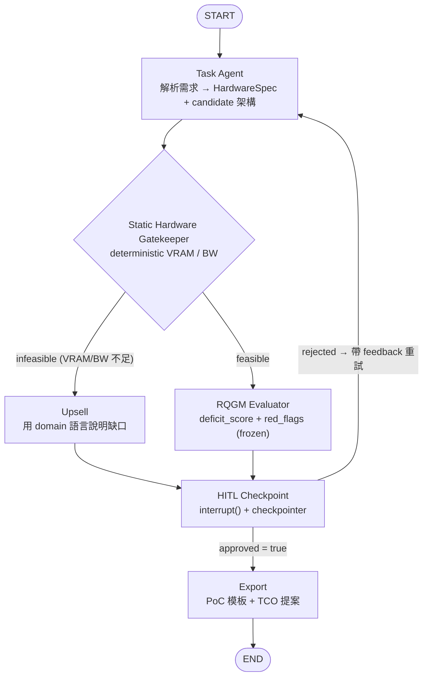
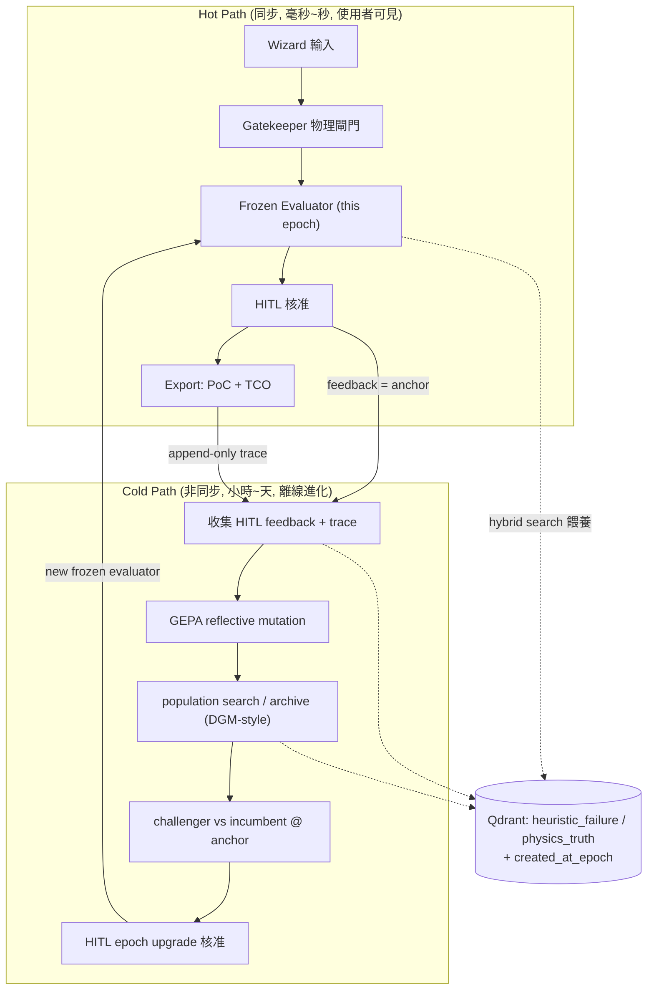
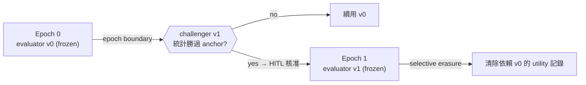
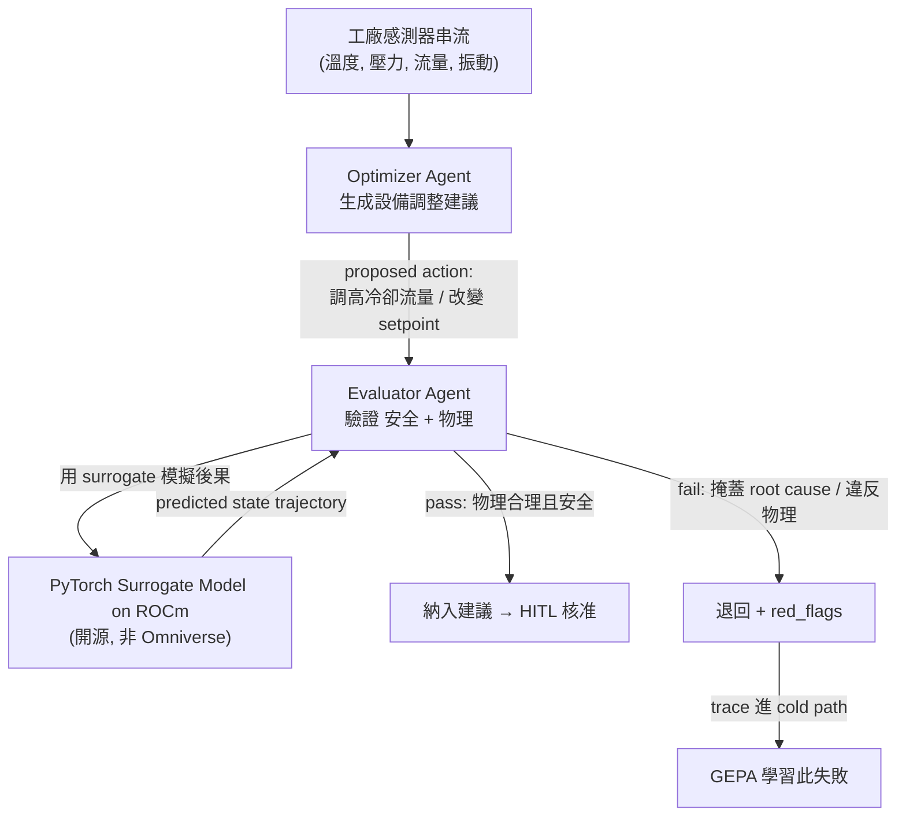
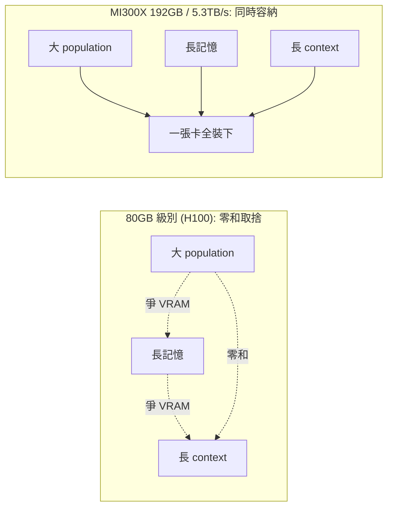

# A1 — System Orchestration / 系統編排

> 模組定位：定義 AgentForge 的**控制流**——誰先跑、誰後跑、人在哪裡介入、long-horizon 任務的記憶為何會崩、以及為什麼 AMD 的記憶體是唯一解。
> 上游：[`blueprint.md`](./blueprint.md) §3 架構總覽。下游：[`02-sizing-math.md`](./02-sizing-math.md)（記憶體數學）、[`03-evaluator.md`](./03-evaluator.md)（evaluator 內部）。

---

## 1. 編排哲學：一條線分開「物理」與「品味」

整個系統的控制流只有一個核心主張：**deterministic 的先擋，fuzzy 的後審**。

- 任何請求先過 `Static Hardware Gatekeeper`（物理閘門）。物理不可行的東西，連 LLM 都不用叫——省算力、零幻覺、可稽核。
- 只有物理可行的請求，才交給會花錢的 `RQGM Evaluator`（品味閘門）去判「這個 agent 架構在這個 domain 到底好不好」。

這個順序不是效能優化的副產品，而是**信任模型的體現**：我們願意讓 fuzzy 的判斷進化，但**絕不讓進化的東西凌駕於物理之上**。因此 Gatekeeper 永遠在 Evaluator 上游。

我們用 **LangGraph** 把這條線實作成一張 `StateGraph`。選 LangGraph 的理由很務實：它把 **state schema、checkpointer、human-in-the-loop（`interrupt()`）** 當一等公民，正好對應本平台三個硬需求——可稽核的狀態、可回復的長流程、可插入的人工核准。

---

## 2. State Schema：唯一真相來源

LangGraph 的 state 是一個 `TypedDict`。它是整張圖唯一的共享真相；每個 node 讀它、回傳 partial update、由 reducer 合併。我們刻意讓 state 的欄位**反映架構的關注點分離**：物理欄位與品味欄位在型別上就分開。

```python
from typing import TypedDict, Literal, Annotated
from operator import add

class HardwareSpec(TypedDict):
    tier: Literal["T1_ryzen_ai", "T2_rx7900xtx", "T3_w7900", "T4_mi300x"]
    vram_gb: float
    bandwidth_tb_s: float

class GatekeeperVerdict(TypedDict):
    feasible: bool
    vram_required_gb: float          # M_weights + M_kv + M_act + overhead
    vram_available_gb: float
    est_tokens_per_s: float          # BW / bytes_per_token 上界
    missing_component: str | None    # 供 upsell 用 domain 語言解釋
    upgrade_path: list[str]          # AMD tier 升級建議

class EvaluatorVerdict(TypedDict):
    deficit_score: float             # 從滿分往下扣（見 03-evaluator）
    red_flags: list[str]
    epoch_id: int                    # 由哪個 epoch 的凍結 evaluator 判的

class AgentForgeState(TypedDict):
    # --- 輸入 ---
    domain: str                      # e.g. "smart_manufacturing"
    requirement: str                 # 自然語言需求
    hardware: HardwareSpec
    # --- 物理閘門（deterministic）---
    gate: GatekeeperVerdict
    # --- 品味閘門（fuzzy, epoch-frozen）---
    verdict: EvaluatorVerdict
    # --- HITL ---
    hitl_feedback: str | None        # domain expert 回饋 = ground-truth anchor
    approved: bool
    # --- 稽核軌跡（append-only）---
    trace: Annotated[list[dict], add]  # 完整 execution trace，餵給 GEPA
    # --- 產出 ---
    export_bundle: dict | None       # PoC 模板 + TCO 提案
```

**設計要點**：

- `trace` 用 `Annotated[list, add]` 當 reducer，讓每個 node 的軌跡**只增不減**（append-only）。這條 trace 之後會成為 cold-path GEPA 的「textual gradient」原料——GEPA 讀的是完整 execution trace，不是被壓成 scalar 的 reward（見 [`03-evaluator.md`](./03-evaluator.md) §5）。
- `gate` 與 `verdict` 型別分離，**在型別層面**就把「永不進化的物理」與「會進化的品味」隔開，呼應 [`blueprint.md`](./blueprint.md) 鐵律 I/II。
- `epoch_id` 隨 verdict 一起記錄，讓每個判斷都可追溯到「哪個凍結 evaluator 產生的」——這是 selective erasure 的前提（見 §6）。

---

## 3. 主編排圖（Task Agent → Gatekeeper → RQGM Evaluator → HITL）

hot path 的核心是一條清晰的 pipeline，只在必要處分叉。



各 node 職責：

| Node | 類型 | 職責 | 為何在此位置 |
|------|------|------|-------------|
| `TaskAgent` | LLM | 把自然語言需求解析成結構化 `HardwareSpec` + candidate agent 架構草案 | 唯一需要「理解需求」的地方 |
| `Gatekeeper` | **deterministic** | 算 `VRAM_total` 與 `tokens/s`，判 feasible/infeasible | 擋在 LLM judge 前面，省錢 + 零幻覺 |
| `Upsell` | template | infeasible 時，用 domain 語言解釋「缺哪塊硬體」+ AMD 升級路徑 | 把「不行」變成有建設性的引導 |
| `Evaluator` | **LLM, epoch-frozen** | 對可行架構做 deficit scoring（見 A3） | 只審物理可行的東西 |
| `HITLCheckpoint` | **interrupt** | 暫停等 domain expert 核准；回饋存入 `hitl_feedback` | 人工核准 = ground-truth anchor |
| `Export` | generator | 產出可跑 PoC 模板 + AMD TCO/ROI 提案（見 A4） | 終點交付 |

> 註：所有 mermaid node/edge label 一律加雙引號以容納中文與括號/冒號/逗號。這是本文件集所有圖表的通則。

---

## 4. HITL：`interrupt()` + checkpointer + `Command(resume=...)`

`HITLCheckpoint` 不是一個「呼叫某個審批 API」的 node，而是用 LangGraph 原生的 `interrupt()` 把**整張圖凍結到持久化 checkpointer**，等人回來再從斷點續跑。這對本平台至關重要，因為 domain expert 的回饋可能隔幾小時甚至幾天才來，流程必須能*無狀態損失地*掛起。

```python
from langgraph.graph import StateGraph, START, END
from langgraph.checkpoint.sqlite import SqliteSaver
from langgraph.types import interrupt, Command

def hitl_checkpoint(state: AgentForgeState) -> dict:
    # interrupt() 拋出 GraphInterrupt，圖狀態被 checkpointer 序列化保存，
    # 無限期等待外部 resume。payload 必須 JSON-serializable。
    decision = interrupt({
        "domain": state["domain"],
        "gate": state["gate"],
        "verdict": state["verdict"],
        "ask": "請 domain expert 核准此架構，或提供糾錯回饋",
    })
    # resume 後，decision 即 Command(resume=...) 傳入的值
    return {
        "approved": decision["approved"],
        "hitl_feedback": decision.get("feedback"),
        "trace": [{"node": "hitl", "decision": decision}],
    }

builder = StateGraph(AgentForgeState)
builder.add_node("task_agent", task_agent)
builder.add_node("gatekeeper", gatekeeper)         # deterministic
builder.add_node("upsell", upsell)
builder.add_node("evaluator", evaluator)           # epoch-frozen LLM
builder.add_node("hitl", hitl_checkpoint)
builder.add_node("export", export)

builder.add_edge(START, "task_agent")
builder.add_edge("task_agent", "gatekeeper")
builder.add_conditional_edges(
    "gatekeeper",
    lambda s: "evaluator" if s["gate"]["feasible"] else "upsell",
    {"evaluator": "evaluator", "upsell": "upsell"},
)
builder.add_edge("upsell", "hitl")
builder.add_edge("evaluator", "hitl")
builder.add_conditional_edges(
    "hitl",
    lambda s: "export" if s["approved"] else "task_agent",
    {"export": "export", "task_agent": "task_agent"},
)
builder.add_edge("export", END)

# checkpointer 讓 interrupt() 能持久化掛起；thread_id 指認要 resume 哪個流程
with SqliteSaver.from_conn_string("checkpoints.sqlite") as saver:
    graph = builder.compile(checkpointer=saver)
    cfg = {"configurable": {"thread_id": "session-42"}}
    result = graph.invoke(initial_state, cfg)      # 跑到 interrupt() 掛起
    # ... 幾小時後，domain expert 回饋進來 ...
    result = graph.invoke(
        Command(resume={"approved": False, "feedback": "你只是把感測器讀數 clamp 住，沒查 valve"}),
        cfg,                                        # 同一個 thread_id 續跑
    )
```

三個必要條件（缺一不可）：

1. **checkpointer**：`interrupt()` 依賴持久化層才能掛起/續跑。開發用 `SqliteSaver`，production 換 `PostgresSaver`。
2. **`thread_id`**：`config={"configurable": {"thread_id": ...}}` 指認要 resume 哪個流程狀態。
3. **`Command(resume=...)`**：resume 傳入的值會成為 `interrupt()` 的回傳值；node 從**開頭重新執行**（故 node 內 `interrupt()` 之前的邏輯要 idempotent）。

**跨 thread 長期記憶**：`checkpointer` 只管單一 thread（單次 session）的短期狀態；跨 session 的長期知識（如「這個 domain expert 一貫討厭 numerical duct-tape」）走 LangGraph `Store`，並與 `Qdrant` 演化記憶（見 [`03-evaluator.md`](./03-evaluator.md) §8）對接。

---

## 5. Hot / Cold Path 分離

使用者體驗與自我進化是**兩個時間尺度**的東西，硬綁在一起會兩敗俱傷：進化拖慢互動，互動打斷進化。因此我們把它們切成兩條路徑，用 `Qdrant` 記憶與 `epoch` 邊界縫合。



| 面向 | Hot Path | Cold Path |
|------|----------|-----------|
| 時間尺度 | 毫秒～秒 | 小時～天 |
| 觸發 | 使用者每次請求 | 累積足夠 feedback / 排程 |
| 成本 | 低（1 次 frozen judge 呼叫） | 高（population × rollouts，見 DGM ≈ $22k/80-iter） |
| 可否進化 | **否**（evaluator 凍結） | **是**（GEPA mutation） |
| 硬體壓力 | 單卡即可（T1–T3） | 記憶體容量×頻寬（T4 MI300X 的主場） |
| 失敗影響 | 使用者等待 | 無使用者影響（背景重試） |

**為什麼一定要分**：cold path 的 population search 會同時撐開幾十上百個 branch 的 KV cache（見 [`02-sizing-math.md`](./02-sizing-math.md) §4 的 KV explosion）。若與 hot path 共用同一張卡，會直接排擠使用者請求的延遲。分離後，hot path 保證 SLA，cold path 吃飽 VRAM 慢慢演化——這正是 MI300X 192 GB 的價值所在。

---

## 6. Epoch Freeze：讓「自我改進」這句話有意義

**問題**：如果一邊產生解法、一邊改評分標準，那「這個 epoch 比上個 epoch 好」根本無從比較——你連尺都在變。

**解法（借自 RQGM）**：把時間切成 **epoch**。在一個 epoch 內，evaluator（那把「尺」）**完全凍結**。因為 utility function 在 epoch 內是 stationary 的，「per-epoch 自我改進」才是一個定義良好、可驗證的命題。



epoch 生命週期：

1. **Epoch 內（frozen）**：hot path 所有判斷都由**同一個** frozen evaluator 產生，並蓋上 `epoch_id`。此期間 cold path 可以盡情 GEPA mutation，但產出的 challenger **不上線**。
2. **Epoch 邊界（gating）**：challenger evaluator 必須在 **held-out ground-truth anchor**（本平台 = domain-expert HITL feedback）上*統計勝過* incumbent，才有資格取代它。cold-start label 不足時，退化為 HITL 直接核准（見 [`blueprint.md`](./blueprint.md) 路線圖 P1→P2）。
3. **升級後（selective erasure）**：只清除「其效用值依賴被替換 evaluator」的記錄（靠 `created_at_epoch` 過濾），保留仍有效的知識。**非全量清空**——這是與「每次重訓歸零」最關鍵的差異。

> 為什麼 evaluator 必須在進化 harness *之外*：若讓「解法」與「評分者」在同一迴圈內共同進化，系統會學會 reward hacking（生成專門討好當前評分者的解法）。把 evaluator 凍結在 epoch 內、且升級要過*外部* anchor，就從結構上斷了這條捷徑。完整論證見 [`03-evaluator.md`](./03-evaluator.md) §7。

---

## 7. Anchor 情境：智慧製造（Optimizer vs Evaluator，全開源）

抽象講完，落到一個具體、可端到端跑的錨定 domain：**智慧製造 / 工廠製程優化**。這個情境同時展示「兩個 agent 對抗」與「開源驗證器取代 Omniverse」。

### 7.1 兩個對抗的 agent



- **Optimizer Agent**：面對感測器狀態，生成「設備調整」建議（例如「把 3 號機台冷卻閥開度 +15%、setpoint 調高 2°C」）。它是**創造者**，天生會為了「讓數字好看」而抄近路。
- **Evaluator Agent**：不看「數字有沒有變好」，而看「這個調整在物理上到底發生了什麼」。它是**批判者**，職責是抓出 numerical duct-tape（見 [`03-evaluator.md`](./03-evaluator.md) §3 三大 failure mode 與 poison pill）。

這正是 anchor 情境的教學價值：**Optimizer 會被症狀騙，Evaluator 必須看穿到 root cause**。例如 broken cooling valve 造成溫度飆升，naive Optimizer 會去「調高 setpoint 容忍度」把警報壓掉（duct-tape）；合格 Evaluator 會識破——真正的問題是 valve 卡死，不是 setpoint。

### 7.2 開源驗證器：PyTorch surrogate on ROCm（明確地**不是** Omniverse）

Evaluator Agent 要驗證「這個調整的物理後果」，需要一個能預測製程動態的模擬器。主流示範用 NVIDIA Omniverse——**閉源、鎖定供應商、教育場景複製不了**。本平台明確拒絕這條路，改用：

- **PyTorch surrogate model on ROCm**：用歷史製程資料訓練一個 neural surrogate（例如 temporal CNN / Neural ODE / GNN），逼近「給定當前狀態 + 動作 → 未來狀態軌跡」。訓練與推論全跑在 ROCm 上（`torch` ROCm build）。它*不是*高保真物理引擎，而是一個**足夠好、可微分、可自架**的代理模型。
- **開源物理引擎**（可選補強）：對需要剛體/流體/接觸動力學的子問題，接 open-source 引擎（如 MuJoCo / Genesis 等）當 ground-truth 生成器，再蒸餾進 surrogate。

```text
surrogate:  s_{t+1..t+H} ≈ f_θ(s_t, a_t)     # f_θ = PyTorch model on ROCm
Evaluator 判準：
  1. 動作後的 predicted trajectory 是否違反硬物理約束（溫度上限、壓力上限）？
  2. 症狀被壓下去了，但 root-cause 狀態變數（如 valve 開度殘差）是否仍異常？→ duct-tape red flag
  3. 對 correlated sensor noise 注入後，判斷是否仍穩健（見 A3 diagnostic resilience）？
```

**為什麼這個選擇是對的**：surrogate model 本身就是一個吃記憶體頻寬的 batched inference 工作負載。當 cold path 對一整個 population 的候選動作做 rollout 時，surrogate 要被呼叫成千上萬次——這又回到 AMD 記憶體頻寬的主場（見 §8 與 [`02-sizing-math.md`](./02-sizing-math.md)）。開源 + ROCm 讓「驗證器」這一層也擺脫供應商鎖定，整條迴圈才真正可自架、可教學、可稽核。

---

## 8. Long-Horizon 記憶退化：為什麼 AMD 記憶體是終極解

### 8.1 問題：context 會「腐爛」

Agent 在 long-horizon 任務（多輪製程優化、跨 epoch 的失敗累積）中會遭遇兩種記憶退化：

1. **Context degradation / rot（上下文腐爛）**：隨著 context window 被填滿，模型對早期資訊的注意力被稀釋，關鍵的「歷史失敗教訓」被新 token 淹沒。表現為 agent 反覆犯同一個已知錯誤——因為那條教訓早被擠出有效注意力範圍。
2. **KV cache 壓力下的被迫遺忘**：為了容納長 context 或大 population，系統被迫 evict KV 或截斷歷史。在 negative-result log 很大時（「過去 500 個失敗解法」），VRAM 不足會逼你丟棄記憶——而丟掉的往往正是最該記住的失敗。

這兩者的共同根源是：**有用的記憶（尤其是 persistent negative-result log）成長速度超過 VRAM 容納能力**。

### 8.2 為什麼「更大更快的記憶體」是根本解，而非權宜

自我進化 agent 的知識，很大一部分是 **negative results**：「這條路試過了，因為 X 物理原因失敗」。這種記憶有三個特性讓它特別吃硬體：

- **只增不減**：每個 epoch 都在累積新失敗，log 單調成長。
- **必須 hot**：evaluator 每次判斷都要 hybrid search 這份記憶（見 [`03-evaluator.md`](./03-evaluator.md) §8），它不能被塞到慢速儲存，否則 hot path SLA 崩。
- **與 population 爭 VRAM**：cold path 的大 population 已經吃掉大量 KV（見 [`02-sizing-math.md`](./02-sizing-math.md) §4），記憶還要再分一杯羹。

在 80 GB 級別的卡上，你被迫在「population 大小 × context 長度 × 記憶 footprint」三者間做零和取捨——這正是 context 退化的硬體根因。

**AMD 的答案是把取捨消掉**：



- **容量（192 GB HBM3）**：一張卡就能同時裝下大 population 的 KV + 巨量 persistent negative-result log + 長 context，不必為了記憶去砍 population。DGM 那種 archive-based open-ended evolution 之所以昂貴，正是因為 archive 要一直在線；192 GB 讓 archive 常駐成為可能。
- **頻寬（5.3 TB/s）**：decode 是 memory-bound（見 [`02-sizing-math.md`](./02-sizing-math.md) §3）。更高頻寬直接換成更高 tokens/s，讓「每次判斷都掃一遍大記憶」在延遲上仍可接受。相對 H100 3.35 TB/s、H200 4.8 TB/s，MI300X 的 5.3 TB/s 在「大記憶 hot search」這個工作負載上優勢明確。

一句話收斂：**context 退化不是提示工程問題，是記憶體工程問題。** 當你能把整份演化記憶常駐在高頻寬 HBM 裡、且不必為 population 讓路時，agent 就不再「越跑越笨」。這就是為什麼 AgentForge 把 AMD high-capacity + high-bandwidth memory 當作 long-horizon 可靠性的**架構級前提**，而不是事後的效能調優。量化的容量/頻寬換算與跨卡對比，見 [`02-sizing-math.md`](./02-sizing-math.md)。

---

## 9. 本模組小結

- 控制流恆為 `TaskAgent → Gatekeeper(物理) → Evaluator(品味, frozen) → HITL → Export`；deterministic 永遠擋在 fuzzy 前面。
- HITL 用 LangGraph `interrupt()` + checkpointer + `Command(resume=)` 實作可無限期掛起的核准點，該回饋同時是 ground-truth anchor。
- Hot/Cold path 用 epoch 邊界縫合；evaluator 在 epoch 內凍結，邊界才受控升級 + selective erasure，且 evaluator 恆在進化 harness 之外以防 reward hacking。
- 智慧製造 anchor 用 Optimizer vs Evaluator 對抗 + **PyTorch surrogate on ROCm**（非 Omniverse）當開源驗證器。
- Long-horizon 記憶退化的根因是 VRAM 零和取捨；MI300X 192 GB/5.3 TB/s 把取捨消掉，是架構級前提。

*下一步：[`02-sizing-math.md`](./02-sizing-math.md) — 把上面所有「記憶體壓力」量化成可稽核的公式。*
