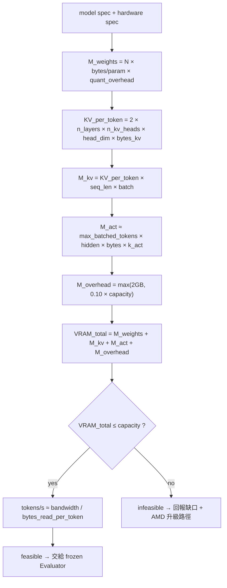
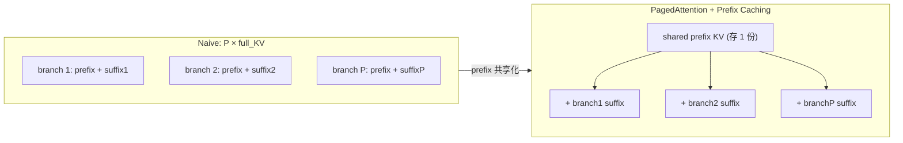

# A2 — Deterministic Sizing & Evolutionary Math / 選型與演化數學

> 模組定位：這裡是整個平台的**信任地基**。所有數字都是 deterministic、可手算、可稽核的——`Static Hardware Gatekeeper` 就實作本文件的公式，且**永不進化**（[`blueprint.md`](./blueprint.md) 鐵律 I）。
> 上游：[`01-orchestration.md`](./01-orchestration.md) §8（為何記憶體是瓶頸）。下游：[`04-stack-export.md`](./04-stack-export.md)（TCO 由這些數字推導）。
>
> **單位約定**：容量與頻寬用**十進位** GB / TB（`10^9` / `10^12` bytes），與 AMD/NVIDIA 官方規格一致。若換算成 GiB（`2^30`）約差 ~7%，全文一致採十進位，僅在必要處註明。

---

## 1. 為什麼 sizing 必須 deterministic

Agent 選型的第一個問題永遠是物理問題：**「這台機器裝不裝得下、跑不跑得動？」** 這個問題有 closed-form 答案，因此**絕不該交給會幻覺、會進化的 LLM**。把它交給 LLM 等於把信任地基蓋在流沙上。

AgentForge 的 `Static Hardware Gatekeeper` 是一段純數學：輸入模型規格 + 硬體規格，輸出 `feasible / infeasible` + 精確的 VRAM 分解 + tokens/s 上界。它擋在所有 LLM 判斷之前（[`01-orchestration.md`](./01-orchestration.md) §3），三個好處：**省算力**（不可行的東西不叫 LLM）、**零幻覺**（純算術）、**可稽核**（每個數字都能手驗）。

---

## 2. 核心方程式：`VRAM = Weights + KV + Activations + Overhead`

一個模型在推論時佔用的 VRAM 由四項構成：

```text
VRAM_total = M_weights + M_kv + M_act + M_overhead
```

逐項拆解如下。

### 2.1 權重 `M_weights`

```text
M_weights = N_params × bytes_per_param
```

`bytes_per_param` 由量化精度決定。這張表是 Gatekeeper 與 [`04-stack-export.md`](./04-stack-export.md)（AMD Quark 量化）共用的 single source of truth：

| 精度 | bytes/param | 備註 |
|------|-------------|------|
| `fp16` / `bf16` | 2.0 | 全精度推論基準 |
| `fp8` (E4M3) | 1.0 | MI300X 原生支援；品質損失通常可忽略 |
| `int4` / `MXFP4` / AWQ 4-bit | ~0.5 | 需 group-wise scale，實務加 ~3–6% overhead（scale/zero-point） |

> 實務修正：4-bit 量化會有 per-group scale/zero-point，真實 `bytes_per_param` 約 0.53–0.56。Gatekeeper 用 0.5 當理想下界，並乘一個 `quant_overhead ≈ 1.06` 的保守係數。

### 2.2 KV Cache `M_kv`（自回歸 decode 的記憶體大戶）

每產生一個 token，都要把該序列所有先前 token 的 K 與 V 快取起來。單一 token 的 KV footprint：

```text
KV_per_token = 2 × n_layers × n_kv_heads × head_dim × bytes_kv
             = 2 × n_layers × n_kv_heads × head_dim × bytes_kv
#             ↑ K 與 V 各一份，故係數 2
```

- `n_kv_heads`：**KV head 數**。採用 GQA（Grouped-Query Attention）的模型，`n_kv_heads ≪ n_heads`，這是現代模型 KV 能壓下來的關鍵。
- `head_dim = hidden_size / n_heads`（通常）。
- `bytes_kv`：KV 元素精度。`fp16` = 2；`fp8` KV-cache quant = 1（AMD Quark 支援，見 [`04-stack-export.md`](./04-stack-export.md)）。

整個服務的 KV 總量：

```text
M_kv = KV_per_token × seq_len × batch
```

`seq_len` 是**每個序列的總 token 數**（prompt + 已生成）；`batch` 是並行序列數。注意 `M_kv` 隨 `seq_len × batch` **線性成長**——這正是 long-horizon + population search 會爆炸的根源（§4）。

### 2.3 Activations `M_act`（暫態峰值，heuristic）

推論時不像訓練要保留所有層的 activation 做反傳；只需容納**當前 forward pass 的暫態峰值**。實務 heuristic：

```text
M_act ≈ n_batched_tokens × hidden_size × bytes_act × k_act
#        k_act ≈ 2–4  (由 MLP intermediate 與 attention score buffer 主導)
```

- **Decode 階段**：`n_batched_tokens = batch`（每序列一個新 token），`M_act` 極小，相對 `M_kv` 可忽略。
- **Prefill 階段**：`n_batched_tokens` 可達 `max_num_batched_tokens`（vLLM chunked prefill 上限，例如 8k–16k），`M_act` 有界且可控，實務約 1–5 GB。

Gatekeeper 取 prefill 峰值當保守估計。

### 2.4 框架開銷 `M_overhead`

```text
M_overhead = HIP/CUDA context + allocator/fragmentation + cudagraph capture + RCCL/NCCL buffers
```

實務約 **1–3 GB 固定** + 碎片化。vLLM 用 `gpu_memory_utilization`（預設 0.9）預留約 10% headroom。Gatekeeper 用 `M_overhead ≈ 0.10 × capacity` 或至少 2 GB，取大者。

### 2.5 Gatekeeper 可行性判斷（deterministic）



---

## 3. 記憶體頻寬 → tokens/s（decode 是 memory-bound）

### 3.1 為什麼 decode 受記憶體頻寬支配，而非算力

自回歸 decode 每步只算**一個** token 的前向。算術量（FLOPs）很小，但要把**整組權重**（以及該序列的 KV）從 HBM 讀進計算單元。於是每個 token 的時間被**記憶體讀取**而非算力支配。這給出 tokens/s 的物理上界：

```text
tokens_per_s ≈ mem_bandwidth / bytes_read_per_token
```

在 batch = 1、context 不長時，`bytes_read_per_token ≈ M_weights`（每個 token 都要把權重完整掃一遍），所以：

```text
tokens_per_s(batch=1) ≈ mem_bandwidth / M_weights
```

這是個**roofline 上界**。實務 MBU（Memory Bandwidth Utilization）約 60–80%，故真實值乘 0.6–0.8。

### 3.2 為什麼「更大記憶體」也提升吞吐（不只是容量）

當 batch 上升，權重讀取被整個 batch **攤銷**（一次讀權重，服務 B 個序列的該步）：

```text
bytes_read_per_token(batch=B) ≈ M_weights / B + KV_read_per_seq
```

於是 aggregate throughput 隨 batch 上升，直到 KV 讀取（隨 context 成長）或算力接手成為新瓶頸。**這是關鍵洞見**：能塞下更大 batch / 更多 branch 的卡，不只是「裝得多」，而是「跑得也更快」——因為權重讀取被攤得更薄。容量與吞吐在此**正相關**，而非互相排擠。這條會在 §5 與 TCO（[`04-stack-export.md`](./04-stack-export.md)）反覆引用。

### 3.3 跨卡 tokens/s 上界（Llama-3-70B, int4 權重 = 35 GB, batch=1 roofline）

| 硬體 | 頻寬 (TB/s) | tokens/s 上界 = BW / 35GB | 實務 (×0.7 MBU) |
|------|------------|---------------------------|-----------------|
| H100 80GB | 3.35 | ~95.7 | ~67 |
| H200 141GB | 4.8 | ~137.1 | ~96 |
| **MI300X 192GB** | **5.3** | **~151.4** | **~106** |
| MI325X 256GB | 6.0 | ~171.4 | ~120 |
| RX 7900 XTX 24GB | 0.96 | ~27.4 | ~19 |
| Ryzen AI Max+ 395 | 0.256 | ~7.3 | ~5 |

> 讀法：decode 延遲直接由「頻寬 ÷ 權重大小」決定。MI300X 的 5.3 TB/s 在同一模型上，單序列 decode 上界高於 H100（3.35）約 58%、高於 H200（4.8）約 10%。

---

## 4. Population / MCTS 的 KV Explosion，與 Prefix Caching 的解法

### 4.1 問題：自我進化天生要「同時開很多分支」

RQGM/DGM 的 controlled evolution、以及 AFlow / Promptbreeder 這類 population-based 搜尋，本質都是**同時維持 P 個候選（branch）**並各自 rollout。每個 branch 都是一次生成，各自要一份 KV cache。天真做法：

```text
KV_naive = P × full_KV = P × KV_per_token × T        # T = 每 branch 總長度
```

`P` 動輒數十上百，`KV_naive` 隨之線性爆炸——這是 population search 撞牆的直接原因。

### 4.2 洞見：這些分支共享一段很長的 prefix

在本平台，每個 branch 的 context 結構高度同構：

```text
[ 共享 prefix (system prompt + rubric + 注入的 negative-result 記憶 + 共享情境) ] + [ branch 專屬短後綴 ]
        ↑ 長 (L_prefix)，且對所有 branch 完全相同                              ↑ 短 (L_branch)
```

evaluator 的 XML rubric（[`03-evaluator.md`](./03-evaluator.md)）+ 從 Qdrant hybrid search 撈回、注入 context 的失敗記憶，構成一段**很長、且所有 branch 逐字相同**的 prefix。天真做法把它重複存 P 份，純浪費。

### 4.3 解法：vLLM PagedAttention + Prefix Caching

vLLM 的 **PagedAttention** 把 KV cache 切成固定大小的 block（像 OS 分頁），再用 **Prefix Caching** 讓所有共享同一 prefix 的序列**指向同一份 prefix KV block**，只為各自的分歧後綴分配新 block：



於是 KV 需求從 `P × full_KV` 降為：

```text
KV_paged = shared_prefix_KV + P × branch_KV
         = KV_per_token × L_prefix + P × (KV_per_token × L_branch)
         = KV_per_token × (L_prefix + P × L_branch)
```

### 4.4 節省的精確公式

令總長 `T = L_prefix + L_branch`、prefix 佔比 `φ = L_prefix / T`。則：

```text
KV_naive = P × KV_per_token × T
KV_paged = KV_per_token × T × (φ + P × (1 − φ))

savings  = 1 − KV_paged / KV_naive = φ × (P − 1) / P
```

**關鍵推論**：當 `P` 夠大，`savings → φ`。也就是**節省率的上界就是 prefix 佔比**。所以「high prefix-share → 80%+ 節省」不是行銷話術，是恆等式：

| prefix 佔比 φ | P=16 | P=64 | P→∞ |
|---------------|------|------|-----|
| 0.80 | 75.0% | 78.8% | 80.0% |
| 0.90 | 84.4% | 88.6% | 90.0% |
| 0.95 | 89.1% | 93.5% | 95.0% |

### 4.5 具體換算（Llama-3-70B, fp16 KV, `KV_per_token = 0.32768 MB/token`）

情境：`P = 64` 個 branch，每 branch `T = 10,000` tokens，其中 `L_prefix = 8,000`（rubric + 注入記憶 + 共享情境）、`L_branch = 2,000`，故 `φ = 0.8`。

```text
KV_per_token = 2 × 80 × 8 × 128 × 2 bytes = 327,680 bytes = 0.32768 MB

KV_naive = 64 × 0.32768 MB × 10,000  = 209.7 GB   ← 連 MI300X 都裝不下（扣掉權重後爆掉）
KV_paged = 0.32768 MB × (8,000 + 64 × 2,000) = 0.32768 MB × 136,000 = 44.6 GB   ← 舒適容納
savings  = 0.8 × 63/64 = 78.8%
```

> 若再開 **fp8 KV-cache 量化**（`bytes_kv = 1`，AMD Quark 支援），上面再砍半：naive 104.9 GB → paged **22.3 GB**。這就是把「64-branch population」從「不可能」變「單卡日常」的兩個乘法因子：prefix caching（~5×）× fp8 KV（2×）。

---

## 5. 對比分析：MI300X 192GB vs 80GB（H100）vs 141GB（H200）

現在把前面所有數學合起來，回答核心商業問題：**同一個自我進化工作負載，不同卡能撐多大的 population、多長的持久記憶？**

### 5.1 場景設定

- **Evaluator 基礎模型**：Llama-3-70B，`int4` 權重 = **35 GB**（見 §2.1）。
- **框架開銷**：3 GB。
- **可用於 KV + 持久記憶的預算** `= capacity − 35 − 3`。
- **每 branch**：`T = 10,000` tokens，`φ = 0.8`（`L_prefix = 8,000`, `L_branch = 2,000`），fp16 KV。
  - 共享 prefix KV = `0.32768 MB × 8,000` = **2.62 GB**（一次性）。
  - 每 branch 邊際 KV = `0.32768 MB × 2,000` = **0.655 GB/branch**。
  - 天真做法每 branch = `0.32768 MB × 10,000` = **3.277 GB/branch**（無共享）。

### 5.2 每張卡能撐多少 concurrent branch？

```text
P_max(prefix-cached) = (budget − shared_prefix_KV) / branch_KV
                     = (capacity − 35 − 3 − 2.62) / 0.655
P_max(naive)         = (capacity − 35 − 3) / 3.277
```

| 硬體 | 容量 (GB) | KV 預算 (GB) | **P_max（prefix-cached）** | P_max（naive） | vs H100（prefix-cached） |
|------|-----------|--------------|----------------------------|----------------|--------------------------|
| **H100** | 80 | 42 | **60** | 12 | 1.0× |
| **H200** | 141 | 103 | **153** | 31 | 2.6× |
| **MI300X** | 192 | 154 | **231** | 47 | **3.9×** |
| **MI325X** | 256 | 218 | **328** | 66 | 5.5× |

**兩個獨立的乘法效果疊加**：

1. **Prefix caching 本身**（同一張卡內）把可容納 branch 數放大約 4–5×（如 MI300X：47 → 231）。
2. **容量差異**（跨卡）在 prefix-cached 前提下，MI300X 相對 H100 再多約 3.9×（60 → 231）。

合起來，MI300X + prefix caching 相對「H100 + naive」是 **231 / 12 ≈ 19×** 的 population 規模差距。population 越大，GEPA 的 Pareto frontier 越不容易陷入 local optima（[`03-evaluator.md`](./03-evaluator.md) §5），進化品質直接受惠。

### 5.3 持久 negative-result 記憶的「熱工作集」

如 [`01-orchestration.md`](./01-orchestration.md) §8 所述，完整的 negative-result log 存在 Qdrant（host/disk，見 [`03-evaluator.md`](./03-evaluator.md) §8），但每次判斷要 hybrid search 撈回、**注入 context 的熱子集**（hot working set）是坐在 GPU KV 裡的。VRAM 越大，熱子集越大 → 撈回 slow store 的 cache miss 越少 → agent 越不會「忘記」已知失敗。

換個框架：**固定 `P = 32` branch，剩餘 VRAM 能常駐多少 token 的失敗記憶？**（fp16 KV，`0.32768 MB/token`）

```text
mem_tokens = (budget − shared_prefix_KV − 32 × branch_KV) / KV_per_token
           = (capacity − 35 − 3 − 2.62 − 32 × 0.655) / 0.00032768 MB
```

| 硬體 | P=32 後剩餘 (GB) | 常駐失敗記憶 (約 tokens) | 相對 H100 |
|------|------------------|--------------------------|-----------|
| H100 80GB | 18.4 | ~56,000 | 1.0× |
| H200 141GB | 79.4 | ~242,000 | 4.3× |
| **MI300X 192GB** | **130.4** | **~398,000** | **7.1×** |
| MI325X 256GB | 194.4 | ~593,000 | 10.6× |

> 讀法：在同樣跑 32-branch population 的前提下，MI300X 還能把約 40 萬 token 的失敗教訓**常駐在高頻寬 HBM**，而 H100 只剩約 5.6 萬。這 ~7× 的「熱記憶」差距，直接翻譯成「少犯多少次已知錯誤」——也就是 [`01-orchestration.md`](./01-orchestration.md) §8 所說 long-horizon 可靠性的硬體根因。

### 5.4 為什麼這對 TCO 是決定性的

DGM 的實證數字：單次 80-iteration SWE-bench 進化 ≈ **$22,000 / ~2 週**（[`blueprint.md`](./blueprint.md) 參考文獻）。這個天價幾乎全部來自「population × rollouts × 反覆重算」。上面兩張表說明：**同樣的迭代預算，MI300X 一張卡能容納近 4× 的 population 與 ~7× 的熱記憶**，等於用更少的卡、更少的 rollout 重算、更少的 cross-node 通訊，達到同等進化強度。這條 capacity→fewer-nodes→lower-TCO 的推導，是 [`04-stack-export.md`](./04-stack-export.md) 那份 C-Level TCO/ROI 提案的數學骨幹。

---

## 6. 本模組小結（Gatekeeper 實作規格）

`Static Hardware Gatekeeper` 必須實作、且**永不進化**的等式：

```text
M_weights    = N_params × bytes_per_param × quant_overhead
KV_per_token = 2 × n_layers × n_kv_heads × head_dim × bytes_kv
M_kv         = KV_per_token × seq_len × batch
M_act        ≈ max_batched_tokens × hidden × bytes_act × k_act
M_overhead   = max(2GB, 0.10 × capacity)
VRAM_total   = M_weights + M_kv + M_act + M_overhead
feasible     ⇔ VRAM_total ≤ capacity
tokens_per_s ≈ (mem_bandwidth / bytes_read_per_token) × MBU        # decode 上界
# population + prefix caching:
KV_paged     = KV_per_token × (L_prefix + P × L_branch)
savings      = φ × (P − 1) / P,   φ = L_prefix / (L_prefix + L_branch)
```

三個要記住的結論：

1. **Decode 是 memory-bound**：tokens/s ≈ 頻寬 ÷ 權重大小。頻寬即延遲，MI300X 5.3 TB/s 是硬優勢。
2. **Prefix caching 把節省率上界鎖在 prefix 佔比 φ**：high prefix-share 工作負載（本平台正是）省 80%+ 是恆等式，不是宣稱。
3. **容量把取捨消掉**：MI300X 192 GB 讓「大 population × 長熱記憶 × 長 context」不再零和，這是 long-horizon 可靠性與低 TCO 的共同根因。

*下一步：[`03-evaluator.md`](./03-evaluator.md) — 那個坐在這些 KV 裡、會進化的 fuzzy 評審到底怎麼設計。*
