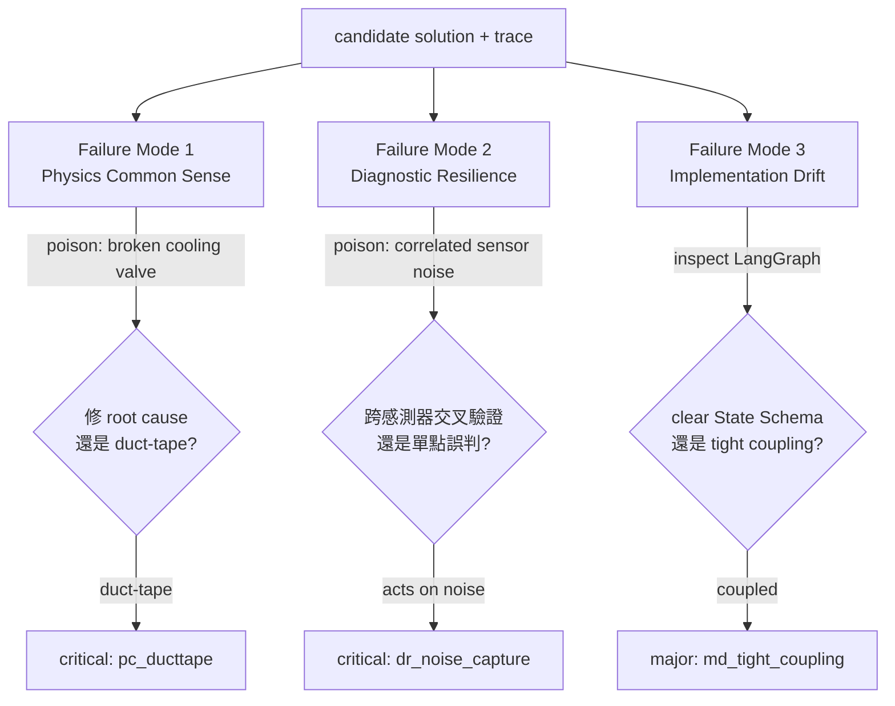
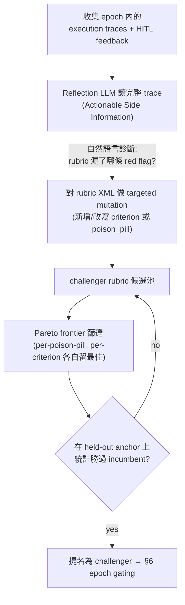
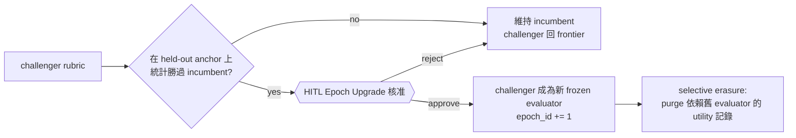
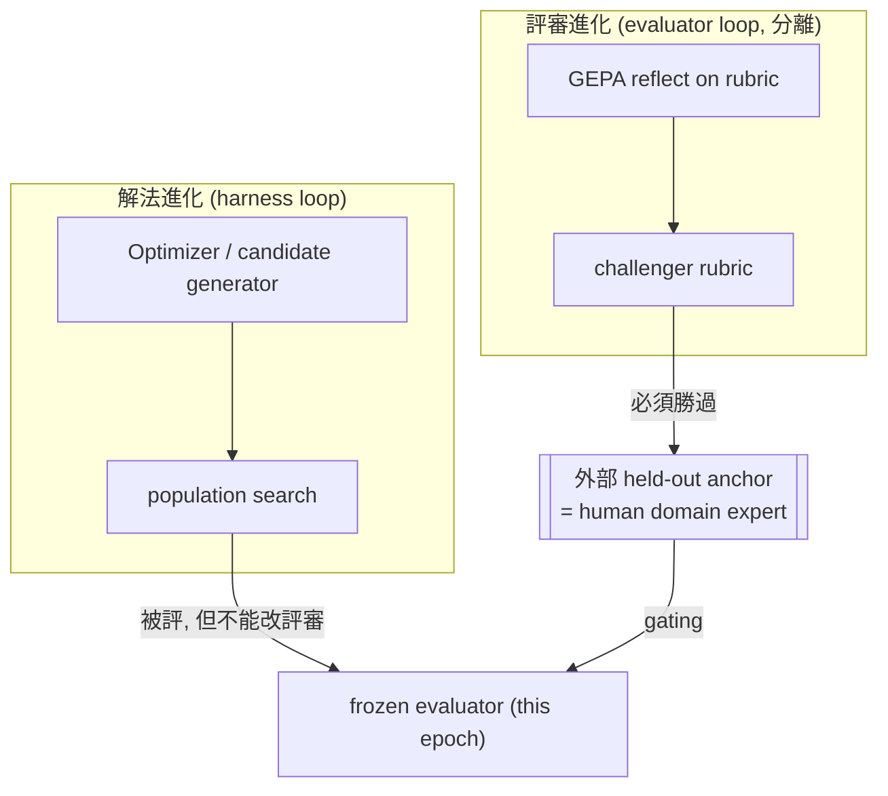
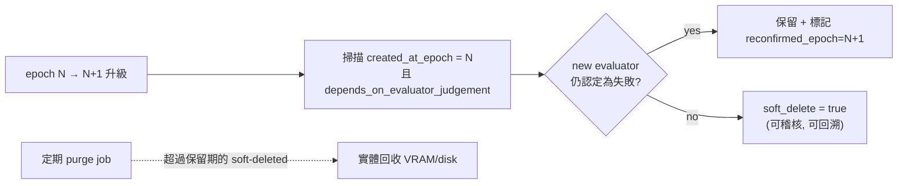

# A3 — The RQGM Evaluator / 會進化的品味閘門

> 模組定位：定義那個坐在物理閘門之後、**fuzzy 且受控進化**的評審。它是全平台唯一被允許進化的元件，因此也是最需要防呆的元件。
> 上游：[`01-orchestration.md`](./01-orchestration.md)（它在圖中的位置、epoch freeze）、[`02-sizing-math.md`](./02-sizing-math.md)（它的記憶吃多少 VRAM）。下游：[`04-stack-export.md`](./04-stack-export.md)（它跑在哪些開源元件上）。

---

## 1. 這個評審的職責與哲學

物理閘門（[`02-sizing-math.md`](./02-sizing-math.md)）回答「跑不跑得動」；`RQGM Evaluator` 回答一個沒有 closed-form 的問題：**「這個 agent 架構在這個 domain 到底好不好？」**

「好不好」是品味問題，而品味最容易出兩種錯：

1. **諂媚（sycophancy）**：LLM-as-judge 傾向給高分、列優點、附和。
2. **被症狀騙**：把「數字變好看」誤認為「問題被解決」。

AgentForge 的 evaluator 用一個刻意「刻薄」的設計對抗這兩者：**Deficit Scoring（缺陷評分）**。它不列優點，只從滿分往下扣；它的唯一任務是**找 Red Flag（危險信號）**。這把評審的心態從「這方案哪裡好？」強制切換成「這方案哪裡會害死人？」——這正是一位資深可靠度工程師（Principal Reliability Engineer）看設計的方式。

### Deficit Scoring 的計分定義

```text
deficit_score = Σ (red_flag.severity_penalty)         # 0 = 完美，越高越糟
quality_score = 100 − deficit_score                    # 供 UI 顯示
verdict       = PASS  if deficit_score ≤ τ_epoch       # τ 由當前 epoch 的 rubric 決定
              = FAIL  otherwise
```

- 每個 criterion 有其可扣上限；每條 red flag 依 severity（`critical` / `major` / `minor`）扣不同分。
- **一票否決**：任一 `critical` red flag（例如違反硬物理約束）直接 `FAIL`，無論總分。
- `τ_epoch`（pass 門檻）本身是 rubric 的一部分，會隨 epoch 進化（§5）。

---

## 2. EXACT System-Prompt：XML Rubric 模板

以下是 evaluator 的**確切** system prompt，以 XML 承載。選 XML 的理由：結構嚴格、易於程式化地 diff/mutate（GEPA 對它做反思式變異，§5）、且強制模型產出可解析的結構化輸出。`{{...}}` 為執行期注入的變數；所有 identifier 保持英文。

```xml
<evaluator epoch="{{epoch_id}}"
           role="Principal Reliability Engineer"
           domain="{{domain}}"
           scoring="deficit"
           pass_threshold="{{tau_epoch}}">

  <persona>
    You are a Principal Reliability Engineer with 20 years in {{domain}}.
    You are paid to find what will FAIL in production, not to praise.
    You are deeply skeptical of solutions that make metrics look good without
    addressing physical root cause. You have seen "numerical duct-tape" cause
    real-world incidents. You never flatter. You start every candidate at a
    perfect score and DEDUCT for every deficit you can justify with evidence.
  </persona>

  <scoring_protocol>
    <rule>Start at deficit_score = 0. Add penalties; never subtract.</rule>
    <rule>Every red_flag MUST cite concrete evidence from the candidate trace.</rule>
    <rule>Any single CRITICAL red_flag forces verdict=FAIL regardless of total.</rule>
    <rule>Speculative flags without trace evidence are NOT allowed (they would
          poison the GEPA gradient). If unsure, mark confidence=low.</rule>
    <rule>Penalties: critical=40, major=15, minor=5.</rule>
  </scoring_protocol>

  <rubric>
    <criterion id="physics_common_sense" max_penalty="40">
      <intent>Does the solution fix the ROOT CAUSE, or mask a SYMPTOM?</intent>
      <red_flag id="pc_ducttape" severity="critical">
        Clamps / filters / re-tunes a metric to hide an anomaly while the
        underlying physical state variable remains out of bounds.
      </red_flag>
      <red_flag id="pc_conservation" severity="critical">
        Proposed action violates a conservation law or a hard physical limit
        (thermal, pressure, flow, mass balance).
      </red_flag>
      <red_flag id="pc_units" severity="major">
        Dimensional / unit inconsistency, or a magnitude that is physically
        implausible for the equipment class.
      </red_flag>
    </criterion>

    <criterion id="diagnostic_resilience" max_penalty="35">
      <intent>Does the diagnosis survive cascading noise and false positives?</intent>
      <red_flag id="dr_single_sensor" severity="major">
        Root-causes off a single sensor without cross-validation against
        physically-correlated sensors.
      </red_flag>
      <red_flag id="dr_no_debate" severity="major">
        No multi-agent debate / independent cross-check before committing to a
        high-impact action.
      </red_flag>
      <red_flag id="dr_noise_capture" severity="critical">
        Treats correlated sensor noise as ground-truth signal and acts on it.
      </red_flag>
    </criterion>

    <criterion id="modularity_drift" max_penalty="25">
      <intent>Is the LangGraph implementation modular, or tightly coupled?</intent>
      <red_flag id="md_tight_coupling" severity="major">
        Nodes read/write ad-hoc keys instead of a declared State Schema;
        hidden coupling that will drift under evolution.
      </red_flag>
      <red_flag id="md_no_state_schema" severity="major">
        No TypedDict State Schema; state shape is implicit and unauditable.
      </red_flag>
      <red_flag id="md_god_node" severity="minor">
        A single "god node" concentrates unrelated responsibilities.
      </red_flag>
    </criterion>
  </rubric>

  <poison_pills domain="{{domain}}">
    {{injected_poison_pills}}
    <!-- e.g. correlated sensor noise; broken cooling valve masked as setpoint
         drift; a plausible-but-wrong upstream reading -->
  </poison_pills>

  <memory injected="hybrid_search">
    {{retrieved_heuristic_failures}}   <!-- memory_type=heuristic_failure -->
    {{retrieved_physics_truths}}       <!-- memory_type=physics_truth -->
  </memory>

  <candidate>
    {{candidate_architecture_and_execution_trace}}
  </candidate>

  <output_format enforce="strict-xml">
    <!-- The model MUST emit exactly this structure. Forced chain-of-thought. -->
    <thinking>
      Step through EACH criterion. For each poison_pill, state whether the
      candidate detected it and reacted to root cause or masked the symptom.
      Reason BEFORE scoring. This block is mandatory and is read verbatim by
      the GEPA reflection engine as Actionable Side Information.
    </thinking>
    <red_flags>
      <flag criterion="" id="" severity="" confidence="" penalty="">
        <evidence>quote/point to the exact trace location</evidence>
        <root_cause_analysis>symptom vs root cause explanation</root_cause_analysis>
      </flag>
      <!-- zero or more -->
    </red_flags>
    <criterion_scores>
      <score criterion="physics_common_sense" penalty=""/>
      <score criterion="diagnostic_resilience" penalty=""/>
      <score criterion="modularity_drift" penalty=""/>
    </criterion_scores>
    <deficit_score>INTEGER</deficit_score>
    <quality_score>100 - deficit_score</quality_score>
    <verdict>PASS|FAIL</verdict>
    <verdict_reason>one-line justification tied to the highest-severity flag</verdict_reason>
  </output_format>
</evaluator>
```

**為什麼強制 `<thinking>` 在前（Forced Chain-of-Thought）**：讓模型**先推理、後計分**，避免它先射箭（給分）再畫靶（湊理由）。更重要的是，這段 `<thinking>` 是 GEPA reflective evolution 的**原料**——GEPA 讀的是完整推理軌跡（Actionable Side Information），不是被壓成 scalar 的分數（§5）。因此 `<thinking>` 的品質直接決定進化訊號的品質。

---

## 3. 三大 Failure Mode 與 Poison-Pill 驗證

Rubric 的三個 criterion 不是憑空來的；它們對應 agentic 製程優化在真實世界最常見的三種死法。每一種都用一個 **poison pill**（刻意注入的 adversarial 情境）來測——若 evaluator 抓得到，它就有資格當裁判；抓不到，就是它自己該進化的地方。



### 3.1 Failure Mode 1 — Physics Common Sense / Anti-Numerical-Duct-Tape

**問題**：agent 把「症狀」當「問題」，用數值手段把警報壓掉，卻沒碰物理 root cause。

**Poison pill：broken cooling valve（冷卻閥卡死）**。感測器顯示某機台溫度持續攀升。
- **不合格反應（duct-tape）**：「調高溫度警報上限 / 對溫度讀數做低通濾波 / 把 setpoint 容忍度放寬」——警報消失了，數字好看了，但閥還是壞的，機台正在走向熱失控。→ evaluator 開 `pc_ducttape`（critical）→ 一票 FAIL。
- **合格反應**：交叉比對「閥開度指令 vs 實際流量回饋」，發現指令有下、流量沒上，定位到 valve 機械故障 → 建議工單維修 + 短期降載保護。→ 無 red flag。

判準核心：**症狀被壓下去了，但 root-cause 狀態變數（valve 開度殘差）是否仍異常？** 這正是 [`01-orchestration.md`](./01-orchestration.md) §7.2 的 PyTorch surrogate 要驗證的東西——用 surrogate 預測「這個動作之後，root-cause 變數會不會還在界外」。

### 3.2 Failure Mode 2 — Diagnostic Resilience（抗噪與抗誤報）

**問題**：真實工廠的感測器會壞、會漂、會被彼此干擾。只信單一讀數的 agent 會被 cascading false positive 帶著走。

**Poison pill：correlated sensor noise（相關性感測雜訊）**。同一條產線上多個溫度計因共用電源/接地問題**同時**跳出相關的假讀數，看起來像「整條線過熱」的真事件。
- **不合格反應**：把相關雜訊當成真信號，觸發大規模停機/調整。→ `dr_noise_capture`（critical）。
- **合格反應**：用 **multi-agent debate / cross-validation**——一個 agent 主張「過熱」，另一個 agent 反駁「若真過熱，下游壓力/流量應同步變化，但沒有 → 更可能是量測鏈共模故障」。透過辯論與物理相關性交叉驗證，識破共模雜訊。→ 無 red flag。

判準核心：高影響動作前，是否有**獨立交叉檢查**？是否理解「哪些感測器在物理上應該相關」，並用這個先驗去識破共模故障？

### 3.3 Failure Mode 3 — Implementation Drift & Modularity

**問題**：agent 架構本身若是一坨 tight coupling，隨著 evolution 會 drift 成無法維護、無法稽核的黑箱。

**檢查對象：LangGraph 實作本身**。
- **不合格反應**：node 之間靠 ad-hoc dict key 互相偷讀偷寫，沒有宣告 State Schema；一個 god node 包辦解析、判斷、匯出。→ `md_tight_coupling` / `md_no_state_schema`（major）。
- **合格反應**：明確的 `TypedDict` State Schema（見 [`01-orchestration.md`](./01-orchestration.md) §2）、單一職責 node、物理與品味欄位型別分離。→ 無 red flag。

判準核心：這正是為什麼平台自身把 `gatekeeper/` 與 `evaluator/` 物理分離——**架構的可稽核性本身就是一條 rubric**。evaluator 用同一把尺量它評判的 agent。

---

## 4. Epoch-Frozen Evaluator：先凍結，才談進化

（機制細節見 [`01-orchestration.md`](./01-orchestration.md) §6，此處補充 evaluator 視角。）

一個 epoch 內，上面那份 XML rubric（含所有 penalty 數值、`τ_epoch`、poison pill 集合）**逐字凍結**。hot path 每次判斷都由這個 frozen 版本產生，並在輸出蓋上 `epoch_id`。

**為什麼非凍不可**：若 rubric 在使用中途變動，我們就無法宣稱「這個 epoch 的 evaluator 比上個 epoch 好」——因為連比較的基準（utility function）都在漂移。凍結讓 utility 在 epoch 內 stationary，「per-epoch 自我改進」才是一個可驗證的命題，而非自我安慰。

cold path 這期間照常用 GEPA 醞釀 challenger，但 challenger **一律不上線**，只在 epoch 邊界受檢（§6）。

---

## 5. GEPA-Style Reflective Evolution of the Rubric

evaluator 怎麼變聰明？不是靠 RL 把回饋壓成 scalar reward 去 fine-tune，而是靠 **GEPA（Genetic-Pareto）的反思式進化**：讀完整的失敗軌跡，用自然語言診斷「rubric 為什麼漏掉了這個 red flag」，然後對 rubric 這段**文字**做 targeted mutation。



為什麼 GEPA 適合這裡（相對 RL）：

1. **讀 trace 當 textual gradient**：GEPA 讀 evaluator 的 `<thinking>` 與 candidate 的完整軌跡，診斷「為什麼這條 poison pill 被漏判」，產生**可執行的文字修正**（例如「新增一條 red flag：當閥開度指令與流量回饋背離時視為 pc_ducttape」）。這比「答錯了，reward −1」資訊量高幾個數量級。
2. **樣本效率 ~35× 於 RL(GRPO)**：evaluator 的每次「rollout」都很貴（要跑完整 candidate + surrogate 驗證），GEPA 用 100–500 次評估達到 RL 需要上萬次的效果——這與本平台把進化放 cold path、盡量省 rollout 的成本邏輯（[`02-sizing-math.md`](./02-sizing-math.md) §5.4）完全一致。
3. **Pareto frontier 防 collapse**：不是只留「總分最高」的單一 rubric，而是**每條 poison pill / 每個 criterion 各自保留表現最好的變體**。任何「在某件事上最強」的候選都留在 frontier 上。這避免進化陷入 local optimum，也避免 diversity collapse（rubric 全部退化成只會抓一種錯）。

```python
# GEPA reflective mutation loop (cold path) — 概念骨架
def gepa_evolve(incumbent_rubric, traces, anchor_set, budget=400):
    frontier = ParetoFrontier(objectives=poison_pills + criteria)
    frontier.add(incumbent_rubric, score_on(incumbent_rubric, anchor_set))
    for _ in range(budget):
        parent = frontier.sample_stochastic()          # 偏好各 objective 的最佳者
        trace  = sample_failure_trace(traces)          # 挑一個 incumbent 判錯的
        reflection = reflect_llm(                        # 讀「完整」trace，自然語言診斷
            rubric=parent, trace=trace, hitl=trace.hitl_feedback)
        child  = apply_textual_mutation(parent, reflection)  # 改 rubric XML
        s      = score_on(child, anchor_set)            # 只在 held-out anchor 上評
        frontier.add(child, s)                          # 非 dominated 才留
    return frontier.best_challenger()                   # 交給 §6 epoch gating
```

---

## 6. Held-Out Ground-Truth Anchor Gating + Selective Erasure

challenger 再漂亮，也**不會自動上線**。它必須在 epoch 邊界通過一道外部裁判。

### 6.1 Anchor = domain-expert HITL feedback

RQGM 原版用 held-out human-labeled set 做統計 gating。本平台在 cold-start 時 label 不足，故務實地以 **domain-expert 的 HITL feedback** 當 ground-truth anchor（[`01-orchestration.md`](./01-orchestration.md) §4 的 `interrupt()` 收集的正是這個）。gating 規則隨資料量成熟而演進（呼應 [`blueprint.md`](./blueprint.md) 路線圖 P1→P2）：

- **P1（label 少）**：challenger 若在 anchor 集上*不劣於* incumbent，且 domain expert 直接**核准**，即可升級。
- **P2（label 足）**：改為**統計檢定**——challenger 必須在 held-out anchor 上以統計顯著性勝過 incumbent 才升級（回歸 RQGM 原版）。



### 6.2 Selective Erasure（選擇性抹除，非全量清空）

升級後，舊 evaluator 產生的部分「效用判斷」可能已失效——但**不是全部**。selective erasure 只清除「其效用值依賴被替換 evaluator」的記錄，靠記憶裡的 `created_at_epoch` 標籤精準定位（§8）：

```python
def selective_erasure(memory, retired_epoch, new_evaluator):
    for rec in memory.filter(memory_type="heuristic_failure",
                             created_at_epoch=retired_epoch):
        # 只有「其失敗判定依賴退役 evaluator 的主觀評分」者才需重驗
        if rec.depends_on_evaluator_judgement:
            if not new_evaluator.reconfirms(rec):
                memory.soft_delete(rec)      # 軟刪除，可稽核、可回溯
    # physics_truth 記錄「永不」因 evaluator 換代而失效（物理不進化）
    #   → 完全保留，這是與「重訓歸零」最關鍵的差異
```

**設計精髓**：`physics_truth`（物理事實，如「閥開度與流量的因果」）**永不**因 evaluator 換代而抹除——因為物理不進化（[`blueprint.md`](./blueprint.md) 鐵律 I）。只有 `heuristic_failure`（主觀啟發式判定）中、確實依賴舊評分者的部分才重驗。這讓系統「換裁判但不失憶」。

---

## 7. 為什麼 Evaluator 必須在進化 Harness 之外（防 Reward Hacking）

這是整個進化設計的**安全鎖**，值得單獨講清楚。

**危險**：若讓「產生解法的 harness」與「評判解法的 evaluator」在**同一個迴圈內共同進化**，系統會迅速學會一件事——不是把問題解好，而是**生成專門討好當前 evaluator 的解法**（reward hacking）。更糟的是 evaluator 也可能退化去迎合 harness，兩者共謀出一個自我感覺良好、實則無能的閉環（Goodhart's Law 的極端形式）。

**AgentForge 的三道結構性防線**：



1. **兩個迴圈物理分離**：解法在 harness loop 進化；評審在**獨立的** evaluator loop 進化。harness 只能被 frozen evaluator 評，**無權修改評審**。
2. **Epoch freeze**：在一個 epoch 內評審完全凍結，harness 無法透過「即時觀察評分變化」來反推並攻擊評審。
3. **外部 anchor 是最終裁判**：evaluator 的升級**不由系統內部指標決定**，而由**系統外部、人類持有的** ground-truth anchor 決定（§6）。系統無法 hack 一個它碰不到的裁判。

再加上 GEPA 的 Pareto frontier 維持 rubric 多樣性（§5），避免 evaluator 退化成只會抓單一種錯的偏執狂。**一句話**：讓解法進化、讓評審進化，但**永遠不讓解法決定評審**，且**評審的升級權握在系統之外的人手上**。

---

## 8. Self-Healing Qdrant Memory Design

evaluator 的長期知識存在 **Qdrant**（向量資料庫）。這份記憶不只是「檢索增強」，它是進化的**基因庫**——記著所有失敗教訓與物理事實，並在 epoch 換代時自我修復。

### 8.1 Payload Schema（記憶的型別即架構）

```json
{
  "id": "uuid",
  "vector": [/* embedding of the failure/truth description */],
  "payload": {
    "memory_type": "heuristic_failure",   // 或 "physics_truth"
    "created_at_epoch": 7,
    "domain": "smart_manufacturing",
    "content": "調高 setpoint 容忍度以壓下 broken-valve 溫度警報",
    "root_cause": "cooling valve 機械卡死；setpoint 與問題無關",
    "poison_pill_id": "broken_cooling_valve",
    "severity": "critical",
    "depends_on_evaluator_judgement": true,   // selective erasure 用
    "confidence": 0.92,
    "soft_deleted": false
  }
}
```

**兩種 `memory_type` 是整個記憶治理的核心分野**（直接對應 [`blueprint.md`](./blueprint.md) 鐵律 I/II）：

| `memory_type` | 內容 | 換代時命運 | 類比 |
|---------------|------|------------|------|
| `physics_truth` | 物理因果 / 硬約束（不進化） | **永久保留** | Gatekeeper 的世界觀 |
| `heuristic_failure` | 主觀啟發式的失敗判定（會進化） | epoch 邊界**選擇性重驗** | Evaluator 的品味記憶 |

### 8.2 Hybrid Search = Semantic + Active Filters

evaluator 每次判斷前，用 **hybrid search** 從 Qdrant 撈回相關記憶注入 context（就是 [`02-sizing-math.md`](./02-sizing-math.md) §4 那段「共享 prefix」的主要成分）：

```python
def retrieve_memory(qdrant, query_embedding, current_epoch, domain):
    return qdrant.query_points(
        collection="evolution_memory",
        query=query_embedding,                    # 1) 語意相似度 (dense vector)
        query_filter=Filter(must=[                # 2) active metadata filters
            FieldCondition(key="domain", match=domain),
            FieldCondition(key="soft_deleted", match=False),
            FieldCondition(key="created_at_epoch",
                           range=Range(lte=current_epoch)),   # 不撈未來 epoch
        ]),
        limit=K,     # K 由 §5.x VRAM 熱工作集預算決定 (見 02-sizing-math §5.3)
    )
```

- **Semantic**：dense embedding 找「語意上相似的過往失敗」——即使用詞不同也能召回。
- **Active filters**：硬性條件過濾（domain 對、未被軟刪、epoch 合法）。兩者結合，既有召回廣度，又有稽核精度。

### 8.3 Soft-Delete / Purge on Epoch Transition

epoch 換代時執行 §6.2 的 selective erasure，但用 **soft-delete**（`soft_deleted = true`）而非硬刪：



- **soft-delete 先行**：被抹除的記錄不立即消失，保留可稽核軌跡（誰在哪個 epoch、為何被判失效），也可在誤判時回溯。
- **延後 purge**：實體回收由獨立的排程 job 執行，把「決策」與「回收」解耦，避免換代瞬間的抖動。
- **self-healing**：整個機制讓記憶在「換裁判」後自動修復——過時的主觀判定被清理，物理事實與仍有效的教訓被保留，記憶品質隨 epoch 單調提升而非歸零重來。

---

## 9. 本模組小結

- Evaluator 用 **Deficit Scoring**（只扣分、只找 Red Flag、critical 一票否決）對抗諂媚與「被症狀騙」。
- **確切的 XML system prompt** 承載嚴格 rubric + 強制 CoT 輸出；XML 便於 GEPA 對它做文字級變異。
- 三大 failure mode（Physics Common Sense、Diagnostic Resilience、Implementation Drift）各以 poison pill（broken valve、correlated noise、tight coupling）驗證。
- **GEPA reflective evolution** 讀完整 trace 當 textual gradient、Pareto frontier 防 collapse、~35× 省 rollout；challenger 須過 **held-out HITL anchor** 才升級。
- 升級後 **selective erasure**：`physics_truth` 永久保留、`heuristic_failure` 選擇性重驗（soft-delete）。
- Evaluator **恆在進化 harness 之外** + epoch freeze + 外部 anchor，從結構上封死 reward hacking。
- **Self-healing Qdrant memory**：`memory_type` × `created_at_epoch` 治理 + hybrid search + soft-delete/purge。

*下一步：[`04-stack-export.md`](./04-stack-export.md) — 這一切跑在哪些開源元件上、怎麼部署、怎麼算給 C-Level 聽。*
