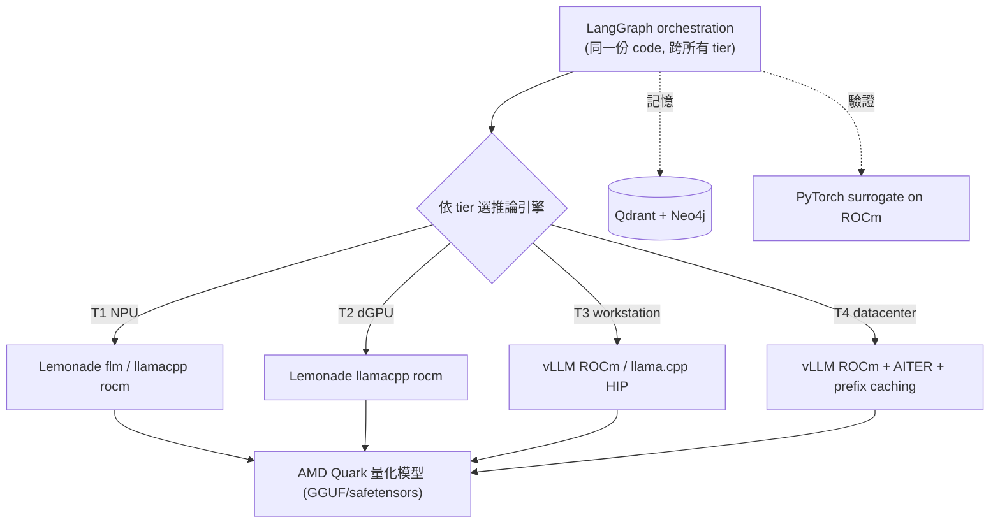
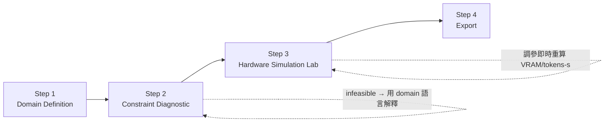
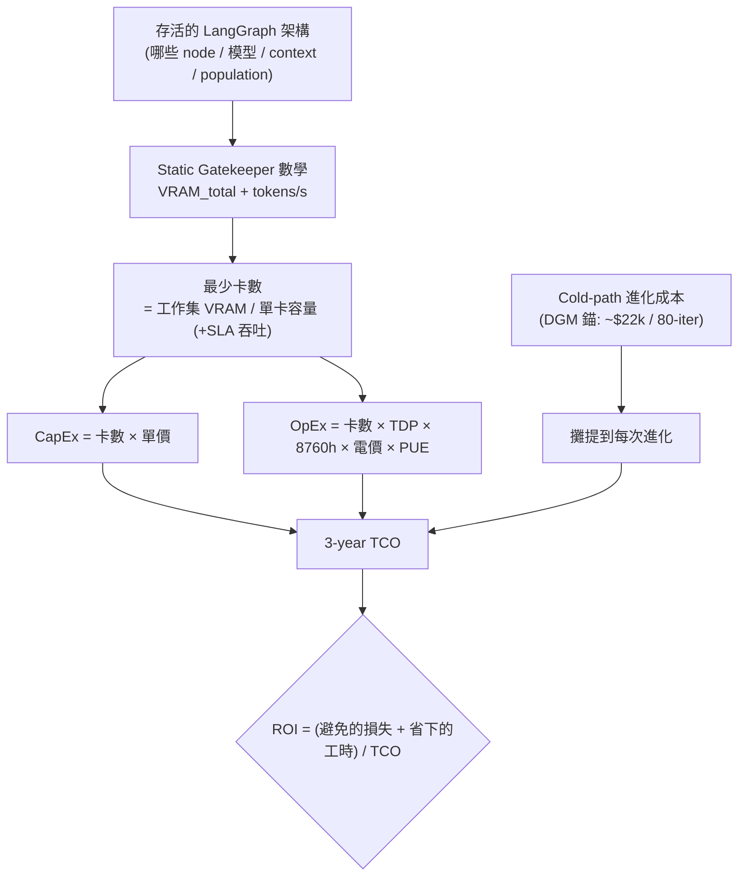

# A4 — Open-Source ROCm Stack & Export / 技術棧、部署與 TCO 匯出

> 模組定位：把前三個模組的架構落到**具體的開源元件、可跑的部署檔、以及能說服 C-Level 的 TCO/ROI 提案**。這裡是「藍圖」與「可跑產品」的接縫。
> 上游：[`01-orchestration.md`](./01-orchestration.md)（要部署的圖）、[`02-sizing-math.md`](./02-sizing-math.md)（TCO 的數學骨幹）、[`03-evaluator.md`](./03-evaluator.md)（要跑的 evaluator + 記憶）。

---

## 1. 純開源 ROCm 技術棧

AgentForge 的每一層都有一個**開源、ROCm-first** 的元件。這不是理想主義，而是產品定位的硬需求：教育場景與中小企業必須能**完整複製**整條棧，不能有任何一環卡在閉源或供應商鎖定上（[`blueprint.md`](./blueprint.md) 鐵律 VI）。

| 層 | 元件 | 授權 | 角色 |
|----|------|------|------|
| **Orchestration** | LangGraph | MIT | State graph、checkpointer、`interrupt()` HITL（[`01-orchestration.md`](./01-orchestration.md)） |
| **Inference (datacenter)** | vLLM ROCm | Apache-2.0 | PagedAttention + Prefix Caching；T3/T4 主力（`rocm/vllm-dev:main`） |
| **Inference (edge/local)** | Lemonade SDK | Apache-2.0 | OpenAI-compatible 本地 server；backends `flm`(NPU)/`llamacpp {rocm,vulkan}` |
| **Inference (fallback)** | llama.cpp (HIP/ROCm) | MIT | 跨 tier 的 GGUF 通用後備 |
| **Local agent framework** | GAIA | MIT | AMD 本地 agent + RAG pipeline（T1/T2 快速起步） |
| **Quantization** | AMD Quark | MIT/Apache | AWQ/GPTQ/SmoothQuant/FP8/MXFP4、KV-cache quant、export safetensors/GGUF |
| **Vector memory** | Qdrant / Milvus | Apache-2.0 | 演化記憶 hybrid search（[`03-evaluator.md`](./03-evaluator.md) §8） |
| **Graph memory** | Neo4j (Community) | GPLv3 | 因果/製程知識圖（`physics_truth` 的結構化承載） |
| **Simulation** | PyTorch (ROCm) surrogate | BSD | 開源 surrogate 驗證器，取代 Omniverse（[`01-orchestration.md`](./01-orchestration.md) §7.2） |

### 1.1 技術棧 ↔ 4 AMD Tier 對應

同一套邏輯架構，跑在四個 tier 上時**推論引擎與量化策略不同**（tier 規格見 [`blueprint.md`](./blueprint.md) §5）。這張表是 wizard「Hardware Simulation Lab」的決策核心：

| 元件 / Tier | **T1 — Ryzen AI Max+ 395** | **T2 — RX 7900 XTX** | **T3 — W7900** | **T4 — MI300X / MI325X** |
|-------------|----------------------------|----------------------|----------------|--------------------------|
| 記憶體 | ≤128 GB unified / 0.256 TB/s | 24 GB / 0.96 TB/s | 48 GB / 0.864 TB/s | 192–256 GB / 5.3–6.0 TB/s |
| 推論引擎 | Lemonade `flm`(XDNA2 NPU) / `llamacpp rocm`(iGPU) | Lemonade `llamacpp rocm` / vLLM ROCm | vLLM ROCm / llama.cpp HIP | **vLLM ROCm** (`rocm/vllm-dev:main`, AITER) |
| 量化 (Quark) | int4/MXFP4（NPU 友善） | int4/AWQ | fp8/int4 | fp8/fp16（原生 fp8） |
| Prefix caching | 有限（小 population） | ✓ | ✓ | ✓（大 population 主場，[`02-sizing-math.md`](./02-sizing-math.md) §5） |
| 定位 | 個人/教育/離線 | 單卡開發 | 部門級 | population search / 長記憶 / production |
| 本平台狀態 | **真跑** | **真跑** | **真跑** | **模擬**（Gatekeeper 數學 + 縮小 population） |

> Tier 4 無實機，一律以 Static Gatekeeper 公式 + 縮小 population 迴圈**模擬**，且在 UI 明確標示 `SIMULATED`（[`blueprint.md`](./blueprint.md) 鐵律 VII）。



---

## 2. 4-Step Interactive Wizard UX

hot path 的使用者介面是一個四步精靈，把「選型」從黑箱變成一段可稽核、有教學價值的旅程。



### Step 1 — Domain Definition（定義問題）
選擇或定義 domain pack（錨定 domain = `smart_manufacturing`）。載入該 domain 的 poison pills、rubric 片段、workflow templates。**教學點**：讓使用者先想清楚「我要 agent 解決什麼、什麼叫做失敗」，再談硬體。

### Step 2 — Constraint Diagnostic（物理診斷）
輸入現有硬體 + 需求（模型、context 長度、並行量、是否要自我進化）。`Static Hardware Gatekeeper`（[`02-sizing-math.md`](./02-sizing-math.md)）即時判 feasible/infeasible。**關鍵 UX**：infeasible 時**不只說「不行」**，而是用 domain 語言解釋「缺哪一塊」——例如「你要跑 64-branch 進化，但這張 24 GB 卡連 KV 都裝不下（需 ~45 GB），缺的是**記憶體容量**，不是算力」，並給出 AMD 升級路徑。

### Step 3 — Hardware Simulation Lab（互動沙盒）
核心互動頁。使用者拖動 model size / 量化精度 / context 長度 / population 大小，即時看到：
- **VRAM 分解長條**：`M_weights + M_kv + M_act + M_overhead`（各段顏色，對照 [`02-sizing-math.md`](./02-sizing-math.md) §2）。
- **tokens/s 儀表**：decode 上界 = `BW / bytes_per_token`（[`02-sizing-math.md`](./02-sizing-math.md) §3）。
- **跨 tier 對比 + 升級解鎖**：同一設定在 T1→T4 各能不能跑、能開多少 branch（[`02-sizing-math.md`](./02-sizing-math.md) §5 的表）。當某設定在當前 tier 爆掉、在 MI300X 可行時，UI 解鎖「升級到 T4」並標 `SIMULATED`。
- **Prefix caching 開關**：即時展示 `savings = φ(P−1)/P` 帶來的 KV 縮減。

**教學點**：讓使用者*親手*撞到記憶體牆，再親眼看到 prefix caching 與 AMD 大記憶體如何把牆推開。

### Step 4 — Export（匯出）
一鍵產出兩份可交付物：
1. **可跑 PoC 部署模板**：`docker-compose` + LangGraph boilerplate（§3），照 Step 2/3 的選型參數填好。
2. **AMD TCO & ROI 提案**：C-Level 可讀的採購論證（§4），數字全由 Gatekeeper 數學推導。

---

## 3. 可跑部署：vLLM on ROCm + LangGraph

### 3.1 `docker-compose.rocm.yml`（T4 模擬 / T3 真跑）

Export 產生的核心檔。所有 ROCm/HIP 旗標齊備，可直接在具 AMD GPU 的主機上 `docker compose up`：

```yaml
services:
  vllm:
    image: rocm/vllm-dev:main            # AMD 官方 vLLM ROCm 映像
    devices:
      - "/dev/kfd"                        # ROCm compute 裝置
      - "/dev/dri"                        # GPU render 節點
    group_add:
      - "video"                           # 存取 GPU 所需群組
      - "render"
    ipc: host                             # 大 shared-memory (tensor/KV) 必要
    security_opt:
      - "seccomp=unconfined"              # ROCm 部分 syscall 需要
    environment:
      - "VLLM_ROCM_USE_AITER=1"           # 主開關: 自動選 ROCM_AITER_FA (MHA)
      - "HF_HOME=/models"
      # - "VLLM_ROCM_SHUFFLE_KV_CACHE_LAYOUT=1"  # 高並行 decode 再 +15~20%
    volumes:
      - "./models:/models"
    ports:
      - "8000:8000"
    command: >
      vllm serve amd/Llama-3-70B-Instruct-quark-int4
      --enable-prefix-caching
      --gpu-memory-utilization 0.9
      --max-model-len 16384
      --port 8000

  qdrant:                                 # 演化記憶 (03-evaluator §8)
    image: qdrant/qdrant:latest
    ports: ["6333:6333"]
    volumes: ["./qdrant_storage:/qdrant/storage"]

  backend:                                # LangGraph 編排 + Gatekeeper + Evaluator
    build: ../backend
    depends_on: ["vllm", "qdrant"]
    environment:
      - "OPENAI_BASE_URL=http://vllm:8000/v1"   # vLLM 走 OpenAI-compatible
      - "QDRANT_URL=http://qdrant:6333"
    ports: ["8080:8080"]
```

等價的 **CLI**（不用 compose 時）：

```bash
docker run -it --rm \
  --device /dev/kfd --device /dev/dri \
  --group-add video --group-add render \
  --ipc host --security-opt seccomp=unconfined \
  -e VLLM_ROCM_USE_AITER=1 \
  -v "$PWD/models:/models" -e HF_HOME=/models \
  -p 8000:8000 \
  rocm/vllm-dev:main \
  vllm serve amd/Llama-3-70B-Instruct-quark-int4 --enable-prefix-caching
```

> `--enable-prefix-caching` + `VLLM_ROCM_USE_AITER=1` 這兩個旗標，正是把 [`02-sizing-math.md`](./02-sizing-math.md) §4 的 KV 節省與 §3 的 AITER 加速**實際打開**的開關。缺一，那些數字就只是紙上談兵。

### 3.2 量化：AMD Quark（`scripts/quantize_quark.py` 骨架）

vLLM 載入的 int4/fp8 權重由 Quark 產出：

```bash
pip install amd-quark \
  --extra-index-url https://pypi.amd.com/quark/rocm72/simple
```

```python
# 概念骨架: 把 fp16 模型量成 int4 (AWQ) + fp8 KV cache
from quark.torch import ModelQuantizer
from quark.torch.quantization import Config, get_config

cfg = get_config("awq_int4")          # 亦支援 gptq / smoothquant / fp8 / mxfp4
cfg.kv_cache_dtype = "fp8"            # KV-cache 量化 → 02-sizing-math §4.5 再砍半
quantizer = ModelQuantizer(cfg)
qmodel = quantizer.quantize(model, calib_dataloader)
quantizer.export(qmodel, path="./models/Llama-3-70B-quark-int4",
                 export_format="safetensors")   # 或 "gguf" 給 llama.cpp/Lemonade
```

### 3.3 LangGraph Boilerplate（把 vLLM 接進圖）

Export 產出的 orchestration 骨架，把 §3.1 的 vLLM endpoint 當 model backend 接進 [`01-orchestration.md`](./01-orchestration.md) 的 state graph：

```python
from langchain_openai import ChatOpenAI
from langgraph.graph import StateGraph, START, END
from langgraph.checkpoint.sqlite import SqliteSaver
from langgraph.types import interrupt, Command
# from state import AgentForgeState   # 見 01-orchestration §2

# vLLM (ROCm) 走 OpenAI-compatible endpoint
llm = ChatOpenAI(base_url="http://vllm:8000/v1", api_key="EMPTY",
                 model="amd/Llama-3-70B-Instruct-quark-int4", temperature=0)

def gatekeeper(state):                 # deterministic, 永不進化 (02-sizing-math)
    v = compute_vram(state["hardware"], state["requirement"])
    return {"gate": v, "trace": [{"node": "gatekeeper", "vram": v}]}

def evaluator(state):                  # epoch-frozen LLM (03-evaluator)
    rubric = load_frozen_rubric(epoch=current_epoch())
    memory = retrieve_memory(qdrant, embed(state["requirement"]), current_epoch(),
                             state["domain"])        # hybrid search → 共享 prefix
    out = llm.invoke(render_xml(rubric, memory, state))
    return {"verdict": parse_verdict(out),
            "trace": [{"node": "evaluator", "raw": out}]}

def hitl(state):                       # interrupt() HITL = ground-truth anchor
    d = interrupt({"gate": state["gate"], "verdict": state["verdict"],
                   "ask": "domain expert 核准或糾錯"})
    return {"approved": d["approved"], "hitl_feedback": d.get("feedback"),
            "trace": [{"node": "hitl", "decision": d}]}

b = StateGraph(AgentForgeState)
for name, fn in [("gatekeeper", gatekeeper), ("evaluator", evaluator), ("hitl", hitl)]:
    b.add_node(name, fn)
b.add_edge(START, "gatekeeper")
b.add_conditional_edges("gatekeeper",
    lambda s: "evaluator" if s["gate"]["feasible"] else "hitl")
b.add_edge("evaluator", "hitl")
b.add_conditional_edges("hitl", lambda s: END if s["approved"] else "evaluator")

with SqliteSaver.from_conn_string("checkpoints.sqlite") as saver:
    graph = b.compile(checkpointer=saver)   # checkpointer 讓 interrupt() 可持久掛起
```

---

## 4. 自動化 "AMD TCO & Hardware Procurement ROI Proposal"（C-Level）

Export 的第二份產出，是把整個技術決策翻譯成 C-Level 語言的採購論證。它的力量在於：**每個數字都不是業務嘴砲，而是從 Static Gatekeeper 數學與「存活下來的 LangGraph 架構」推導出來的**。

### 4.1 從架構到 TCO 的推導鏈



**核心洞見**：TCO 的主導變因不是「單卡貴不貴」，而是**「這個工作集需要幾張卡」**。而卡數由 [`02-sizing-math.md`](./02-sizing-math.md) §5 的容量數學決定——記憶體容量越大，同一工作集需要的卡越少，於是 CapEx、OpEx、機櫃、網路、故障面**全部**下降。這就是「AMD 大記憶體 → 更少節點 → 更低 TCO」的完整推導。

### 4.2 卡數推導（沿用 [`02-sizing-math.md`](./02-sizing-math.md) §5 工作集）

目標工作集：Llama-3-70B int4（權重 35 GB）+ `P=64` population（prefix-cached）+ ~334k token 熱記憶 + overhead ≈ **192 GB VRAM**（此工作集刻意校準到剛好填滿一張 MI300X）。

| 硬體 | 單卡容量 | **達成工作集所需卡數** | 主因 |
|------|----------|------------------------|------|
| **MI300X** | 192 GB | **1** | 容量剛好容納，無跨卡開銷 |
| MI325X | 256 GB | 1（且有餘裕擴 population） | 容量更大 |
| H200 | 141 GB | 2 | 需跨卡切分工作集 |
| H100 | 80 GB | 3–4 | 權重複製 + 跨卡 KV 協調開銷 |

> 一張 MI300X 做到的事，H100 要 3–4 張。這不是效能微調，是**節點數的量級差異**——而節點數是 TCO 的主導項。

### 4.3 TCO 公式（`export/tco.py` 實作）

```text
# --- 由 Gatekeeper 數學決定 ---
n_cards      = ceil( working_set_VRAM / card_capacity )          # 容量約束
n_cards      = max(n_cards, ceil(SLA_tokens_per_s / card_tokens_per_s))  # 吞吐約束

# --- CapEx / OpEx ---
CapEx        = n_cards × card_unit_cost                          # 單價為規劃假設值
OpEx_energy  = n_cards × card_TDP_kW × 8760h × price_kWh × PUE   # /year
OpEx_infra   ∝ n_cards                                           # 機櫃/網路/冷卻/維運

# --- Cold-path 進化 (DGM 成本錨) ---
Evolve_cost  = (rollouts / DGM_rollouts) × $22,000               # 每輪進化攤提
             ↓ 隨 n_cards 下降而下降 (更少跨節點重算, 02-sizing-math §5.4)

TCO_3yr      = CapEx + 3 × (OpEx_energy + OpEx_infra) + N_evolutions × Evolve_cost
```

**illustrative 實例**（單價/電價為規劃假設，非報價；用以示範推導，實際以當期採購為準）：

| 項目 | 1× MI300X | 3× H100 | 說明 |
|------|-----------|---------|------|
| 卡數 | 1 | 3 | §4.2 |
| TDP | 0.75 kW | 3 × 0.7 = 2.1 kW | MI300X 750W / H100 700W |
| 年電費 | 0.75×8760×0.12×1.4 ≈ **$1,103** | 2.1×8760×0.12×1.4 ≈ **$3,089** | 電價 $0.12/kWh, PUE 1.4 |
| 3-yr 電費 | ~$3.3k | ~$9.3k | 3× 差距 |
| 機櫃/網路/維運 | 1 節點 | 3 節點 (+RCCL/NCCL 互連) | 隨卡數線性放大 |
| Cold-path 重算 | 單卡, 無跨節點 | 跨 3 卡協調 population | §5.4, MI300X 省重算 |

> 電費一項，3 年就差約 3×；再加上 CapEx（3–4 張 vs 1 張）、機櫃/網路/冷卻/維運（3 節點 vs 1 節點）、以及 cold-path 跨節點重算的額外成本，整體 TCO 差距遠大於「單卡單價」給人的直覺。

### 4.4 ROI：省下的與避免的

ROI 分子由「存活架構」的實際效益構成，全部可追溯到前面模組：

- **避免的產線事故**：Deficit-Scoring evaluator 抓出的每一個 `critical` red flag（如 broken-valve duct-tape，[`03-evaluator.md`](./03-evaluator.md) §3.1），對應一次可能的停機/報廢損失。
- **省下的工程師工時**：wizard + Gatekeeper 把「選型 + PoC 搭建」從數週壓到數小時；GEPA 把 evaluator 調校從 RL 的上萬 rollout 壓到數百（~35×，[`03-evaluator.md`](./03-evaluator.md) §5）。
- **避免的過度採購**：Gatekeeper 誠實數學讓企業**不會**為了保險而超買硬體，也**不會**買不夠導致專案失敗。這一條本身常常就回收了平台導入成本。
- **避免的供應商鎖定**：全開源 ROCm 棧讓企業保留議價權與遷移權（無法量化，但 C-Level 極在意）。

### 4.5 提案輸出格式（工具產出的 Markdown 骨架）

```markdown
# AMD Hardware Procurement Proposal — {{domain}} Agentic Platform

## 1. Executive Summary
- Recommended tier: **{{tier}}** ({{card}} × {{n_cards}})
- 3-year TCO: **${{tco_3yr}}**  |  Est. ROI: **{{roi}}×**
- Rationale (one line): {{surviving_architecture}} 的工作集為 {{working_set_gb}} GB，
  由 Static Gatekeeper 數學推導，{{card}} 單卡容量即可容納 → 節點數最小化。

## 2. Technical Sizing (auditable)
| Item | Value | Formula |
|------|-------|---------|
| M_weights | {{m_weights}} GB | N × bytes/param |
| M_kv (P={{P}}, prefix-cached) | {{m_kv}} GB | KV_per_token × (L_prefix + P·L_branch) |
| tokens/s (decode) | {{tps}} | bandwidth / bytes_per_token |
| Cards required | {{n_cards}} | ceil(working_set / capacity) |

## 3. TCO Breakdown (AMD vs alternative)   ## 4. ROI Drivers   ## 5. Risks & Simulation Caveats
```

**閉環**：這份提案的每個數字都能往回追到 [`02-sizing-math.md`](./02-sizing-math.md) 的公式與 [`03-evaluator.md`](./03-evaluator.md) 的評審結果。C-Level 看到的不是「相信我們」，而是「這裡是算式，自己驗」。這正是 AgentForge 對「可信度」的最終交付——**從物理常數到採購決策，全程可稽核**。

---

## 5. 本模組小結

- 每一層都有 open-source、ROCm-first 元件（LangGraph / vLLM ROCm / Lemonade / GAIA / llama.cpp HIP / Qdrant / Neo4j / AMD Quark），並依 T1–T4 切換推論引擎與量化策略。
- 4-step wizard（Domain → Constraint Diagnostic → Simulation Lab → Export）把選型變成可稽核、有教學價值的旅程；Simulation Lab 讓使用者親手撞牆再看 AMD 記憶體推開牆。
- Export 產出**可跑**的 `docker-compose.rocm.yml`（`/dev/kfd`+`/dev/dri`、`group_add video/render`、`ipc host`、`seccomp=unconfined`、`VLLM_ROCM_USE_AITER=1`、`--enable-prefix-caching`）+ LangGraph boilerplate + Quark 量化腳本。
- **TCO/ROI 提案**由 Static Gatekeeper 數學推導：工作集 VRAM → 最少卡數 → CapEx/OpEx/進化成本 → TCO；核心論證是「AMD 大記憶體 → 更少節點 → 更低 TCO」，DGM ~$22k/80-iter 為 cold-path 成本錨。

---

*回到 [`blueprint.md`](./blueprint.md) 檢視全局，或依 [`blueprint.md`](./blueprint.md) §7 的路線圖進入 Phase B PoC 實作。*
