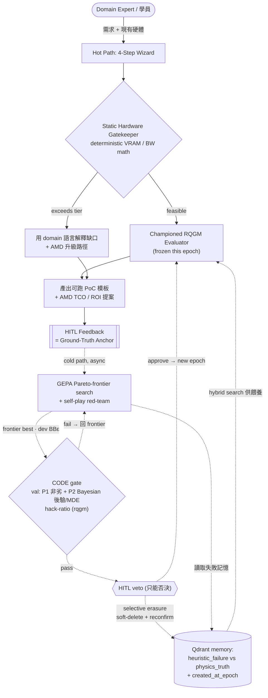
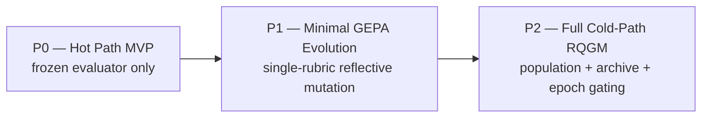

# AgentForge — AMD-Centric Heuristic AI Agent Educational & Sizing Platform

> **Master Blueprint / 主索引**
> 一個 100% open-source、ROCm-based 的「可自我進化 AI Agent 選型與教育平台」架構藍圖。
> 以 deterministic 硬體閘門守住物理邊界，以 RQGM/GEPA 迴圈進化 fuzzy 的 domain evaluator。
>
> **Working name**: `AgentForge`（產品名刻意避開 "RQGM" — 該機制有專利討論，本平台只採用其*已發表的機制概念*）。
> **Status**: Phase A blueprint（本文件集）；`backend/` 已依此藍圖實作 hot path + RQGM 進化迴圈（code gate、Pareto frontier、selective erasure、rqgm hack-ratio、judge panel、記憶回撈）。offline judge 為 deterministic rubric-aware mock，真 live 評分需本地模型（Lemonade/vLLM）——見 [`../README.md`](../README.md)。
> **Scope of this document set**: `docs/` 子樹，純文件（架構藍圖）；可執行程式碼在 `backend/`。

---

## 0. 這份藍圖要解決的問題

企業導入 agentic AI 時反覆撞上三堵牆：

1. **選型黑箱**：「我這台機器/這筆預算，到底跑不跑得動我要的 agent？」沒有人能給出*可稽核的*答案，全是廠商話術。
2. **可信度崩壞**：LLM-as-judge 會被 reward-hack、會 drift、會在 long-horizon 任務裡因為 context 退化而「越跑越笨」。
3. **供應商鎖定**：主流示範清一色 NVIDIA + 閉源模擬器（如 Omniverse），中小企業與教育場景根本複製不了。

AgentForge 的立場很直接：**把「物理」和「品味」分開治理**。

- **物理**（VRAM、記憶體頻寬、tokens/s）是 deterministic 的，交給一個**永不進化**的 `Static Hardware Gatekeeper`，用純數學閘門守住。這是整個平台的**信任地基（trust anchor）**。
- **品味**（某個 domain 的解法好不好、有沒有掩蓋 root cause）是 fuzzy 的，交給一個**會進化**的 `RQGM Evaluator`，用 GEPA reflective mutation + epoch 結構 + HITL gating 讓它*受控地*變聰明。

這條分界線不是文件上的宣稱，而是**實體架構**：`gatekeeper/`（deterministic）與 `evaluator/`（fuzzy）在目錄上物理分離，讀 code 就能看懂設計意圖。

---

## 1. Executive Summary / 執行摘要

AgentForge 是一套跑在 AMD open-source ROCm 技術棧上的「Heuristic AI Agent 教育與選型平台」。它把兩個當代 agent 研究成果——**RQGM 的 controlled utility evolution**（受控效用進化）與 **GEPA 的 reflective prompt evolution**（反思式提示進化）——落地成一個對中小企業與教育場景務實可用的產品，並且**全程不依賴任何閉源元件**。

核心設計可濃縮成四句話：

1. **雙閘門（Dual-Gate）**：`Static Hardware Gatekeeper`（deterministic 物理，永不進化）+ `RQGM Evaluator`（fuzzy 品味，受控進化）。物理錯誤零容忍；品味判斷才允許演化。
2. **Hot / Cold Path 分離**：使用者互動（wizard、選型、匯出）走**同步 hot path**，毫秒～秒級；昂貴的自我進化（GEPA mutation、population search、DGM-style archive）走**非同步 cold path**，小時～天級。兩者用 **epoch** 這個時間邊界縫合。
3. **Epoch Freeze + 兩段式 Gating**：evaluator 在一個 epoch 內**凍結**（stationary utility，per-epoch 自我改進保證才成立）；epoch 邊界才允許 challenger 取代 incumbent，且必須先過一道 **code 統計 gate**（held-out labeled anchor `val` 上 P1 非劣 + **P2 Bayesian Beta-Binomial 後驗 `P(Δsep>0)≥0.95` 且 `Δsep≥MDE`**，平手偏袒現任），**HITL 只能否決、不能覆寫失敗的 gate**。升級後做 **selective erasure（soft-delete + reconfirm）**，只軟刪「依賴被替換 evaluator」的 `heuristic_failure` 記錄，`physics_truth` 永久保留。
4. **AMD Memory 是護城河**：agent 自我進化（MCTS/population search + 巨量 persistent negative-result log）的瓶頸不是算力而是**記憶體容量 × 頻寬**。MI300X 的 **192 GB HBM3 / 5.3 TB/s** 讓「一張卡裝下大 population + 長記憶」從不可能變日常——這是把 DGM 那種 *~$22,000 / 80 iteration* 的天價迴圈壓進可負擔 TCO 的關鍵。

**為什麼是 AMD、為什麼全開源**：本平台的 evaluator 要維護一份**持續膨脹的 negative-result 記憶**（「這些解法為什麼失敗」）。這份記憶越大、agent 越不會重蹈覆轍，但也越吃 VRAM。NVIDIA 80 GB 級別的卡會逼你在「population 大小」與「記憶長度」之間做痛苦取捨；MI300X 的 192 GB 直接讓這個取捨消失。搭配 vLLM ROCm 的 **PagedAttention + Prefix Caching**，population 分支間共享的長 prefix 只存一份，KV footprint 可省 **80%+**（詳見 [`02-sizing-math.md`](./02-sizing-math.md)）。整條技術棧（LangGraph、vLLM ROCm、llama.cpp HIP、Lemonade、GAIA、Qdrant、Neo4j、AMD Quark）皆為 open-source，教育與商用皆可自由複製。

---

## 2. 設計鐵律（First Principles / Design Invariants）

這些是不可協商的地基。任何後續設計若與之衝突，改設計、不改鐵律。

| # | 鐵律 | 理由 | 落地機制 |
|---|------|------|----------|
| I | **物理走 deterministic，永不進化** | VRAM/頻寬是硬約束，"進化" 它等於自欺 | `Static Hardware Gatekeeper`（純數學，見 [`02-sizing-math.md`](./02-sizing-math.md)） |
| II | **只有 fuzzy 的 domain 判斷才進化** | 品味沒有 closed-form，需要從失敗中學 | `RQGM Evaluator` + GEPA（見 [`03-evaluator.md`](./03-evaluator.md)） |
| III | **Evaluator 在 epoch 內凍結** | stationary utility 才讓 per-epoch 自我改進保證成立 | epoch freeze（見 [`01-orchestration.md`](./01-orchestration.md)） |
| IV | **Evaluator 必須在進化 harness 之外** | 同時進化「解法」與「評分者」= reward hacking 溫床 | 分離 harness loop（見 [`03-evaluator.md`](./03-evaluator.md)） |
| V | **升級需通過 held-out ground-truth** | 避免 evaluator 自我感覺良好 | **code 統計 gate**（held-out `val`：P1 非劣 + P2 Bayesian 後驗/MDE）+ HITL veto（見 [`03-evaluator.md`](./03-evaluator.md) §6） |
| VI | **100% open-source、ROCm-first** | 教育/中小企業可複製；無供應商鎖定 | 全棧開源（見 [`04-stack-export.md`](./04-stack-export.md)） |
| VII | **模擬要誠實標示** | Tier 4（MI300X）無實機，靠公式模擬 | UI 明示 "SIMULATED"（見 [`04-stack-export.md`](./04-stack-export.md)） |

---

## 3. 架構總覽（雙閘門 + Hot / Cold Path）

下圖是整個平台的骨幹。實線 = **hot path**（同步、使用者可見、毫秒～秒級）；虛線 = **cold path**（非同步、離線、小時～天級）。兩條路徑透過 `Qdrant` 演化記憶與 `epoch` 邊界縫合。



**閱讀順序建議**：先看 hot path（`Wizard → Gate → Judge → Export`）理解使用者體驗，再看 cold path（`Feedback → Loop → EpochGate → Judge`）理解自我進化如何*受控地*發生。

---

## 4. 四大模組索引（Module Index）

本藍圖刻意拆成一個索引 + 四個獨立模組檔，方便逐模組 review 與獨立更新。每個模組同時對應一個 research module 與一個 task objective。

| 模組 | 檔案 | 核心問題 | 關鍵產出 |
|------|------|----------|----------|
| **A1 — Orchestration** | [`01-orchestration.md`](./01-orchestration.md) | 這些 agent 怎麼被編排、HITL 怎麼插入、long-horizon 記憶怎麼不崩？ | LangGraph State Graph、Hot/Cold path、Epoch freeze、智慧製造 anchor 情境（Optimizer vs Evaluator，開源 PyTorch surrogate 取代 Omniverse） |
| **A2 — Sizing Math** | [`02-sizing-math.md`](./02-sizing-math.md) | 一台機器跑不跑得動？多少 concurrent 分支？ | `VRAM = Weights + KV + Activations` 精確公式、bandwidth→tokens/s、MCTS/population 的 KV explosion、Prefix Caching 節省、MI300X 192GB vs 80GB 對比 |
| **A3 — Evaluator** | [`03-evaluator.md`](./03-evaluator.md) | 怎麼判「解法好不好」而不被騙、不 drift、不 reward-hack？ | XML deficit-scoring rubric（三大 failure mode + poison pill + forced CoT）、GEPA reflective evolution、epoch/selective-erasure、self-healing Qdrant memory |
| **A4 — Stack & Export** | [`04-stack-export.md`](./04-stack-export.md) | 用哪些開源元件、怎麼部署、怎麼說服 C-Level 買單？ | ROCm 開源棧↔4 AMD tier 對應、4-step wizard UX、`docker-compose`（`/dev/kfd`、`VLLM_ROCM_USE_AITER=1`）、AMD TCO & ROI 提案自動生成 |

---

## 5. 硬體分層（4 AMD Tiers）

平台把 AMD 產品線抽象成四個 tier；wizard 的 Hardware Simulation Lab 與 Gatekeeper 的可行性判斷都圍繞這四層。規格為 A2/A4 反覆引用的 single source of truth。

| Tier | 代表硬體 | 記憶體 | 頻寬 | 定位 | 本平台策略 |
|------|----------|--------|------|------|-----------|
| **T1 — Edge/NPU** | Ryzen AI Max+ 395 (Strix Halo) | up to 128 GB unified LPDDR5X | ~0.256 TB/s (+ XDNA2 NPU ~50 TOPS) | 個人開發、教育、離線 | **真跑**（Lemonade `flm`/`rocm`） |
| **T2 — Prosumer dGPU** | Radeon RX 7900 XTX | 24 GB GDDR6 | ~0.960 TB/s | 單卡開發/推論 | **真跑**（Lemonade/llama.cpp ROCm） |
| **T3 — Workstation** | Radeon PRO W7900 | 48 GB GDDR6 | ~0.864 TB/s | 部門級、較大模型 | **真跑**（vLLM/llama.cpp ROCm） |
| **T4 — Datacenter** | Instinct MI300X / MI325X | 192 GB / 256 GB HBM3(E) | 5.3 / 6.0 TB/s | population search、長記憶、production | **模擬**（Static Gatekeeper 數學 + 縮小 population 迴圈） |

> 對照組（用於 A2 的 "vs 80GB" 敘事）：NVIDIA **H100 80 GB / 3.35 TB/s**、**H200 141 GB / 4.8 TB/s**。
> 延伸（未來 tier）：MI350X / MI355X **288 GB HBM3E / 8.0 TB/s**。

---

## 6. 名詞表（Glossary）

以「本平台脈絡下的定義」為準，非泛泛學術定義。

| 術語 | 定義（in AgentForge context） |
|------|------|
| **RQGM** | *The Red Queen Gödel Machine*（arXiv 2606.26294）的機制概念：把 search 切成 **epoch**，evaluator 在 epoch 內**凍結**；epoch 邊界時 challenger evaluator 唯有在 **held-out human ground-truth anchor** 上統計勝過 incumbent 才接手，接手後做 **selective erasure**。本平台只借用機制、**不使用其名作為產品名**。 |
| **RSI** | *Recursive Self-Improvement*：系統遞迴地改進「改進自己的能力」。本平台把 RSI 限縮在 evaluator 的 rubric 上，且用 epoch freeze + HITL 把它*馴化*成可稽核。 |
| **GEPA** | *Genetic-Pareto*（arXiv 2507.19457）：reflective prompt evolution，讀完整 execution trace 當「textual gradient」（Actionable Side Information），用 Pareto frontier 保多樣性；比 RL(GRPO) 少約 **35×** rollouts。本平台的 evaluator-evolution 引擎。 |
| **DGM** | *Darwin Gödel Machine*（arXiv 2505.22954）：archive + open-ended evolution + 實證驗證。其 *80-iteration SWE-bench ≈ $22,000 / ~2 週* 的成本，是本平台把完整迴圈放 cold path 並主打 AMD memory TCO 的實證依據。 |
| **Static Hardware Gatekeeper** | Deterministic 的物理閘門，用 `VRAM = Weights + KV + Activations` 與 `tokens/s ≈ BW / bytes_per_token` 判斷可行性。**永不進化**。 |
| **RQGM Evaluator** | Fuzzy 的 domain 品味評審，用 XML deficit-scoring rubric 判「解法好不好」。**受控進化**。 |
| **Deficit Scoring** | 反向評分：不是「加分列舉優點」，而是從滿分往下扣，逐條列 **Red Flag**（缺陷/掩蓋）。天然抗諂媚（sycophancy）。 |
| **Poison Pill** | 刻意注入的 adversarial 情境（如 correlated sensor noise、broken cooling valve），用來測 agent 會不會被騙、會不會用 numerical duct-tape 掩蓋 root cause。 |
| **Numerical Duct-Tape** | 反面教材：用調參/濾波/clamp 把症狀壓下去，卻沒解決物理 root cause。Evaluator 的頭號打擊目標。 |
| **Epoch** | 進化的時間單位。epoch 內 evaluator 凍結（utility stationary）；epoch 邊界才允許升級與 selective erasure。 |
| **Selective Erasure** | epoch 升級時，對「其效用值依賴被替換 evaluator」的 `heuristic_failure` 記錄做 **soft-delete + 新 champion reconfirm**（軟刪不再確認者、延後硬 purge），保留仍有效者；`physics_truth` 永不動。非全量清空。 |
| **Ground-Truth Anchor** | 升級 gating 的裁判。現為一份**真的 held-out human-labeled set**（73 個標註架構，跨 2 個 domain pack，四路拆 `train`/`dev`/`val`/`test`）：GEPA 只讀 `train`、frontier 選在 `dev`、code gate 只在 `val` 上判 P1/P2、`test` 純報告。HITL feedback 另餵給 GEPA 當 side-information，並在 gate 後保留否決權。 |
| **Hot / Cold Path** | Hot = 同步、使用者可見、便宜；Cold = 非同步、離線、昂貴（進化）。 |
| **HITL** | *Human-in-the-Loop*：LangGraph `interrupt()` + checkpointer 實作的人工檢查點；本平台用它同時當 anchor 與 epoch 升級的核准閘。 |
| **KV Cache** | 自回歸 decode 時快取的 keys/values；`KV_per_token = 2 × n_layers × n_kv_heads × head_dim × bytes_kv`。population search 時它會爆炸（見 A2）。 |
| **PagedAttention / Prefix Caching** | vLLM 的記憶體管理：把共享 prefix 的 KV 只存一份，population 只付 `shared_prefix_KV + P × branch_KV`（見 A2）。 |
| **Surrogate Model** | 用 PyTorch on ROCm 訓練的**開源**代理模型，逼近工廠物理/製程回應，取代閉源 Omniverse 當 Evaluator Agent 的驗證器（見 A1）。**已實作**：[`backend/evaluator/surrogate.py`](../backend/evaluator/surrogate.py)——offline deterministic 一階物理近似（驗「動作後 root-cause 變數是否仍在界外」），`AGENTFORGE_SURROGATE=torch` 為選配 ROCm 路徑。 |
| **Tier** | AMD 硬體分層（T1 Ryzen AI → T4 Instinct），見 §5。 |

---

## 7. 分階段路線圖（Phased Roadmap）

進化能力是**逐步解鎖**的，不是一次到位。每個 phase 都能獨立交付價值，且下一 phase 只在前一 phase 的信任地基上疊加。



### P0 — Hot Path（凍結 evaluator，先把選型/教育跑通）
- **交付**：4-step wizard + `Static Hardware Gatekeeper` + 一個**手寫、凍結**的 RQGM Evaluator rubric + Export（PoC 模板 + TCO 提案）。
- **不含**：任何自我進化。evaluator 就是一份固定的 XML prompt。
- **價值**：即使*完全不進化*，「可稽核的選型 + 誠實的 TCO」本身就有商業與教育價值。這一步驗證信任地基（Gatekeeper 數學）。
- **驗收**：智慧製造 anchor 情境能端到端跑；Gatekeeper 對 T1–T4 給出正確可行性與升級路徑。

### P1 — Minimal GEPA Evolution（最小反思進化）
- **交付**：在 P0 上加 **GEPA-style reflective mutation**——讀取 HITL feedback 的完整 trace，對*單一* rubric 做反思式變異（早期設計以 HITL 核准替代統計 gating；**現已升級為 P2 的 code 統計 gate**）。
- **加上**：`Qdrant` 演化記憶（`memory_type` = `heuristic_failure` / `physics_truth`、`created_at_epoch`）。
- **價值**：evaluator 開始能從 domain expert 的糾錯中「長記性」，但仍是單線、可控。
- **驗收**：注入 poison pill 後，evaluator 在 HITL 修正下能於下一 epoch 抓到先前漏掉的 Red Flag，且 selective erasure 正確運作。

### P2 — Full Cold-Path RQGM（完整冷路徑進化）
- **交付**：**Pareto frontier population search**（EvoSkill 風格；top-K 非 dominated、父代 Thompson 取樣、在 `dev` 選擇split 選 best，frontier 持久化到 `data/frontier/` 取代重量級 DGM archive）+ **統計化 epoch gating**（held-out labeled anchor `val` 上 P1 非劣 + P2 Bayesian 後驗/MDE code gate，HITL 只能否決）。
- **加上**：vLLM ROCm PagedAttention + Prefix Caching 撐起大 population；MI300X 192 GB 撐起長記憶（T4 以數學模擬 + 縮小 population 驗證保真度）。
- **價值**：真正的 controlled utility evolution——受控、可稽核、抗 reward-hacking 的自我進化。
- **驗收**：challenger evaluator 能在 held-out `val` anchor 上統計勝出（P1/P2）並安全升級；prefix-share 高的工作負載上 KV 節省 80%+（T4 為 SIMULATED）。

> **實作現況（docs ↔ code reconciled）**：P0、P1 已落地，**P2 的統計化 gating 與 Pareto population 搜尋亦已實作**——`gepa_evolve` 維護 Pareto frontier（`sep::<criterion>` + `parsimony` + `adversarial` 多目標、**父代 Thompson 取樣**、在 `dev` 選擇split 選 best）、code gate 在 held-out `val` 跑 **P1 非劣 + P2 Bayesian Beta-Binomial 後驗/MDE**、strict/loose **hack-ratio** 接官方 `rqgm` 套件並自動收緊 tolerance、報告含 **over-acceptance / over-optimization gap / provenance**、selective erasure 改 **soft-delete + reconfirm**、**judge panel + accuracy/κ 校準**、**hybrid-search 記憶回撈** 皆已接上。**仍為 optional / 未實作**：frontier 節點的 **MCTS**、multi-agent debate（**Thompson-over-frontier 已實作**）。**仍為近似 / 需硬體**：offline judge 是 deterministic rubric-aware **mock**（真評分需 Lemonade/vLLM），prefix-caching 80%+ 節省與 MI300X 大 population 屬 **T4 SIMULATED**。

---

## 8. 跨模組不變式（Invariants Referenced Across Docs）

以下數學/結構在多份文件間共用，於此定義一次，各模組引用。

**核心 sizing 公式**（Gatekeeper 與 A2 共用）：

```text
M_weights    = N_params × bytes_per_param          # int4≈0.5, fp8≈1, fp16≈2 (B/param)
KV_per_token = 2 × n_layers × n_kv_heads × head_dim × bytes_kv
M_kv         = KV_per_token × seq_len × batch
tokens_per_s ≈ mem_bandwidth / bytes_read_per_token   # decode 為 memory-bound 的上界
VRAM_total   = M_weights + M_kv + M_act + framework_overhead
# population / MCTS + prefix caching:
KV_naive     = P × full_KV
KV_paged     = shared_prefix_KV + P × branch_KV        # P = population/branch 數
```

**RQGM Evaluator XML 骨架**（A3 與未來 PoC 共用）：

```xml
<evaluator epoch="{epoch_id}" role="Principal Reliability Engineer" scoring="deficit">
  <rubric>
    <criterion id="physics_common_sense">root cause vs numerical-duct-tape</criterion>
    <criterion id="diagnostic_resilience">survive cascading noise / false positives</criterion>
    <criterion id="modularity_drift">LangGraph coupling vs clear State Schemas</criterion>
  </rubric>
  <poison_pills>correlated sensor noise; broken cooling valve; ...</poison_pills>
  <output><thinking/><red_flags/><deficit_score/></output>
</evaluator>
```

---

## 9. 參考文獻（References）

- **RQGM** — *The Red Queen Gödel Machine*, arXiv:2606.26294 (Cambridge / NVIDIA / MBZUAI / Inria / Flower Labs, Jun 2026). 機制：controlled utility evolution、epoch-frozen evaluator、held-out anchor gating、selective erasure、archive = multi-agent workspace。**（有專利討論；本平台僅採用已發表機制概念，產品名另取。）**
- **DGM** — *Darwin Gödel Machine*, arXiv:2505.22954 (Sakana AI / UBC). archive + open-ended evolution；80-iteration SWE-bench ≈ $22,000 / ~2 週，本平台 cold-path 與 TCO 論述之成本錨。
- **GEPA** — *Reflective Prompt Evolution Can Outperform Reinforcement Learning*, arXiv:2507.19457. Genetic-Pareto、reflective mutation、Pareto frontier、~35× fewer rollouts than GRPO。
- **AMD Instinct** — MI300X 192 GB HBM3 / 5.3 TB/s；MI325X 256 GB HBM3E / 6.0 TB/s（[amd.com/instinct](https://www.amd.com/en/products/accelerators/instinct/mi300.html)）。
- **vLLM ROCm** — image `rocm/vllm-dev:main`；`VLLM_ROCM_USE_AITER=1`；`--enable-prefix-caching`（[ROCm vLLM docs](https://rocm.docs.amd.com/en/latest/how-to/rocm-for-ai/inference-optimization/vllm-optimization.html)）。
- **Lemonade SDK** — AMD open-source, OpenAI-compatible local server（[github.com/lemonade-sdk/lemonade](https://github.com/lemonade-sdk/lemonade)）；backends: `llamacpp {rocm, vulkan}`, `flm` (XDNA2 NPU)。
- **GAIA** — AMD local agent framework, MIT（[github.com/amd/gaia](https://github.com/amd/gaia)）。
- **AMD Quark** — quantization toolkit（[github.com/amd/quark](https://github.com/amd/quark)）；AWQ/GPTQ/SmoothQuant/FP8/MXFP4、KV-cache quant、export safetensors/GGUF。
- **LangGraph** — `interrupt()` + checkpointer (`SqliteSaver`) + `Command(resume=...)` + `Store`（[LangGraph docs](https://docs.langchain.com/oss/python/langgraph/persistence)）。

---

*下一步：閱讀 [`01-orchestration.md`](./01-orchestration.md) 了解系統如何被編排。*
