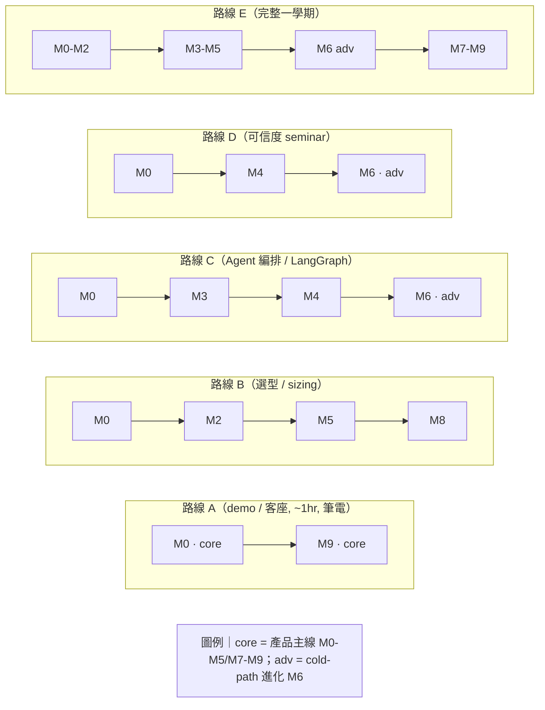

<!--
衍生自 6 層標準的 L3（教學路線）。zkp-final 用 lab/TEACHING-GUIDE.md 承載 L3；本 repo 在 docs/course/ 內
新建 teaching-paths.md，結構對齊：定位 → 依課型挑路線 → 模組一覽 → 逐路線(適用/時長/順序/價值) →
路線圖 mermaid → 誠實邊界。
Diátaxis 類型：how-to（排課）。
-->

# Teaching Paths · 教學路線

給大學教授**排課用**的單一入口：一眼看完 **M0–M9**、依課型挑一條現成路線，並知道每個模組
**獨特教到什麼**。架構細節（雙閘門、hot/cold path、sizing 數學、evaluator 設計）請看
[`../blueprint.md`](../blueprint.md) 與 [`../01-orchestration.md`](../01-orchestration.md)–[`../04-stack-export.md`](../04-stack-export.md)；
逐模組 hands-on / 原始碼 / 驗證指令見 L2 [`module-map.md`](module-map.md)。本檔只做「排課地圖」，交叉連結、不重寫。

> 全部路線都能在**任何筆電上端到端跑**（無需 GPU）：deterministic 物理數字恆為 live，本地推論缺席時
> 自動降級 **MOCK**，Qdrant 缺席時降級 in-memory。**Tier 4 Instinct 一律 `SIMULATED`**。

---

## 1. 定位與依課型挑路線

- **這是什麼**：把 M0–M9 攤平的排課目錄，讓你幾分鐘內決定「這學期帶學生走哪幾個模組、什麼順序、為什麼」。
- **兩條主軸**：**產品主線（M0–M5, M7–M9）** 是 hot path + 物理 + 棧 + 匯出 + capstone；**進階軌（M6）** 是
  cold-path 受控進化（epoch / GEPA / selective erasure）。

| 你的課型 / 場合 | 選這條 | 一句話 |
|---|---|---|
| 單堂 demo / 客座（筆電可跑） | **路線 A** | `demo.sh` 一鍵走完 4-step wizard + HITL + epoch |
| 選型 / 效能物理 / sizing 課 | **路線 B** | deterministic VRAM/頻寬數學 → prefix caching → TCO |
| Agent 編排 / LangGraph 系統課 | **路線 C** | StateGraph + HITL interrupt + hot/cold path |
| 可信度 / anti-reward-hacking seminar | **路線 D** | deficit scoring + epoch freeze + 三道防線 |
| 完整一學期產品實作 | **路線 E** | M0–M9 全跑，最後匯出可跑 PoC |

---

## 2. 模組一覽（M0–M9）

| # | 模組 | 教學價值（1 行） | 軌 | 先修 |
|---|---|---|---|---|
| **M0** | 雙閘門與誠實邊界 | 物理（deterministic）vs 品味（受控進化）的目錄級分離；live/mock/simulated 三分法 | core | — |
| **M1** | 預備知識與環境 | uv/Python + Node；起服務、看 Live/Mock 徽章 | core | M0 |
| **M2** | Gatekeeper 物理數學 | `VRAM=W+KV+Act+Overhead`、`tokens/s=BW/bytes`；decode 為 memory-bound | core | M1 |
| **M3** | LangGraph 編排 + HITL | StateGraph、`interrupt()`+checkpointer、hot/cold path | core | M1 |
| **M4** | RQGM Evaluator | deficit scoring、三大 failure mode + poison pill、抗諂媚 | core | M3 |
| **M5** | Prefix caching / MI300X | `savings=φ(P-1)/P`、KV explosion、容量→吞吐正相關 | core | M2 |
| **M6** | Epoch / GEPA / erasure | epoch freeze、reflective mutation、held-out anchor、selective erasure | adv | M4,M5 |
| **M7** | ROCm 開源棧與部署 | vLLM ROCm / Lemonade / Quark；`docker-compose.rocm.yml` 旗標 | core | M2 |
| **M8** | Export：PoC + TCO/ROI | 「容量→更少節點→更低 TCO」可稽核推導 + 可跑模板 | core | M2,M7 |
| **M9** | Capstone：anchor 端到端 | 4-step wizard + HITL + epoch 全跑（Instinct 標 SIM） | core | M2,M3,M4,M8 |

---

## 3. 教學路線

每條路線標：**適用課堂 · 時長 · 模組順序 · 為什麼有價值**。

### 路線 A — 單堂 demo / 客座（筆電可跑, ~1hr）
- **適用**：單堂客座、demo day、系上 showcase；聽眾不需先備知識、**不需要 GPU**。
- **時長**：~1 小時，全程筆電（推論走 MOCK）。
- **順序**：`M0 → M9`（跑 [`../DEMO.md`](../DEMO.md) 的 `./scripts/demo.sh`）
- **價值**：先用 M0 建立「物理 vs 品味」的信任模型，再用 M9 端到端走完智慧製造 anchor：Domain → Diagnose（超 4.1 GB）
  → Simulate（跨 tier，MI300X 標 SIM）→ Export（TCO + 6 檔）→ HITL → epoch 進化。一條線講完平台能做什麼、誠實邊界在哪。

### 路線 B — 選型 / 效能物理 / sizing 課
- **適用**：系統效能 / LLM 推論 sizing / 硬體選型課。
- **時長**：~2–3 堂。
- **順序**：`M0 → M2 → M5 → M8`
- **價值**：信任模型（M0）→ deterministic VRAM/頻寬數學（M2，`tests/` 鎖住）→ prefix caching 節省與 MI300X
  記憶體優勢（M5，`savings=φ(P-1)/P` 是恆等式不是話術）→ 把 sizing 推成 C-Level TCO/ROI（M8）。學生學會**手算**
  可行性並看穿廠商話術。**備註**：Instinct 相關數字為 `SIMULATED`。

### 路線 C — Agent 編排 / LangGraph 系統課
- **適用**：agentic 系統 / 工作流編排 / LangGraph 課。
- **時長**：~3–4 週。
- **順序**：`M0 → M3 → M4 → M6`
- **價值**：信任模型（M0）→ StateGraph + `interrupt()` HITL + hot/cold path（M3）→ deficit-scoring evaluator（M4）
  → epoch freeze + GEPA + selective erasure（M6，進階）。完整走一遍「可稽核狀態、可掛起長流程、可插入人工核准、受控進化」。

### 路線 D — 可信度 / anti-reward-hacking seminar
- **適用**：AI 安全 / 評估方法 / LLM-as-judge 可信度 seminar。
- **時長**：單元 seminar（~2–3 堂）。
- **順序**：`M0 → M4 → M6`，扣回 [`../03-evaluator.md`](../03-evaluator.md) §7
- **價值**：信任模型（M0）→ deficit scoring 為何抗諂媚與「被症狀騙」（M4，broken valve / correlated noise poison pill）
  → 三道結構性防線（兩迴圈分離、epoch freeze、外部 anchor）如何封死 reward hacking（M6）。主題是「怎麼讓一個會進化的
  評審**不**被自己的系統騙」。

### 路線 E — 完整一學期產品實作
- **適用**：完整一學期「用開源 ROCm 棧做可信 agent 平台」實作課。
- **時長**：~12–14 週。前半建立物理地基與 hot path，後半疊上進化與部署，最後匯出可跑 PoC。
- **順序**：`M0 → M1 → M2 → M3 → M4 → M5 → M6 → M7 → M8 → M9`
- **價值**：一學期同時涵蓋產品主線（選型/編排/匯出）與進階進化（cold path），把整條 ROCm 開源棧從物理常數落到 C-Level 採購決策。

### 路線圖（各路線如何穿過兩軌）

---

## 4. 誠實邊界與注意事項

本平台的核心立場是**「物理永不進化、品味受控進化、Instinct 一律 SIMULATED」**。本檔不重寫誠實 rule，只指路：

- **三分法（先讀這條）**：live（真跑 / deterministic 物理）· mock（無本地推論 server 的 deterministic 降級）·
  simulated（Tier 4 Instinct）。見 [`course-contract.md`](course-contract.md) §5 與 L5 [`validation-ledger.md`](validation-ledger.md)。
- **物理不可被 LLM 講贏**：Gatekeeper 擋在所有 LLM 判斷前（[`../01-orchestration.md`](../01-orchestration.md) §3）。
- **筆電可跑**：`./scripts/dev.sh` + `./scripts/demo.sh` 在無 GPU 的筆電上端到端跑；`uv run pytest` 56 passed 離線。
- **進化受控**：evaluator 凍結於 epoch、只在 HITL 核准下升級、恆在進化 harness 之外（防 reward hacking，見
  [`../03-evaluator.md`](../03-evaluator.md) §7）。
